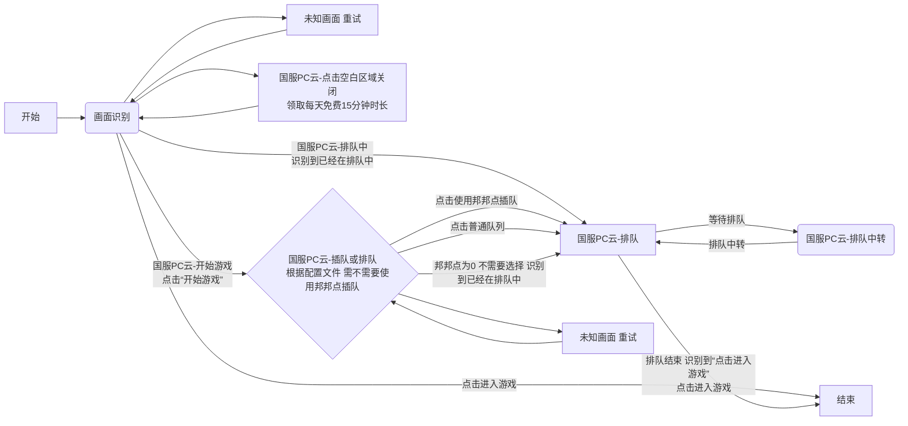

# 云游戏适配文档

本文档旨在说明为适配云游戏所做的各项修改。

## 1. 核心功能：云游戏排队

为了支持云游戏，我们新增了一个独立的 `CloudQueueApp` 模块，专门用于处理云游戏启动时的排队流程。

### 主要逻辑 (`cloud_queue.py`)

下图展示了 `CloudGameQueue` 操作类中各个节点的跳转流程。

### 应用集成 (`cloud_queue_app.py`)

- 将上述排队逻辑封装成一个标准的 `ZApplication`。
- 在主应用 `ZOneDragonApp` 中注册 `CloudQueueApp`，使其作为一条龙流程的一部分，在启动游戏时自动执行。

## 2. 配置与上下文

为了让程序知道当前是否为云游戏环境，并管理相关配置，我们对配置和上下文进行了扩展。

### 游戏账户配置 (`game_account_config.py`)

- 在 `GameAccountConfig` 中增加了 `is_cloud_game` 属性，用于game_path()函数返回云游戏路径，来启动云游戏。

### 上下文扩展 (`zzz_context.py`)

- **动态窗口标题**：根据 `is_cloud_game` 和游戏区域，动态生成游戏窗口标题（例如，“云·绝区零”或“ZenlessZoneZero · Cloud”）。
- **云排队配置加载**：在 `ZContext` 中初始化了 `CloudQueueConfig` 和 `CloudQueueRunRecord`，用于加载和记录云排队相关的设置和状态。

### 新增云排队配置 (`cloud_queue_config.py`)

- 创建了 `CloudQueueConfig` 类，用于管理云游戏排队的特定配置。
- 目前包含一个配置项 `prefer_bangbang_points`，用于决定是否优先使用邦邦点进行快速排队。

## 3. 界面调整

为了让用户可以方便地控制云游戏相关的功能，我们在设置界面中增加了新的选项。

### 一条龙设置界面 (`zzz_one_dragon_setting_interface.py`)

- 在“一条龙”设置页面下，新增了一个“云游戏”设置分组。
- 在该分组下，增加了一个开关选项：“邦邦点快速队列（测试功能）”，允许用户启用或禁用此功能。

## 4. 对现有流程的适配

为了将云游戏排队无缝整合到现有流程中，我们对部分原有操作进行了修改。

### 打开并进入游戏 (`open_and_enter_game.py`)

- 在执行“进入游戏”操作前，会先判断 `is_cloud_game` 配置。
- 如果是云游戏，会先调用 `CloudGameQueue` 执行排队操作，排队成功后 即识别到 "点击进入游戏" 再通过EnterGame执行后续的进入游戏流程。

### 进入游戏操作 (`enter_game.py`)

- 适配了云游戏的登录流程。**没有做云游戏的切换账号功能 所以云游戏只支持单实例 而且需要启动前登录好账号**。当检测到是云游戏时，程序会跳过输入账号密码的步骤（`force_login = False`, `already_login = True`）。

### 修改拖动操作 (`pc_controller_base.py`)

- 目前使用的 drag_mouse 在云游戏不生效 所以重构了 drag_mouse 函数，从使用 pyautogui.dragTo 改为直接调用 ctypes.windll.user32.mouse_event，添加了 steps 参数实现平滑拖拽，通过参数传递PcGameWindow获取到的屏幕尺寸。

### 修改关闭游戏方法 

- 原本使用的关闭游戏是 ctypes.windll.user32.PostMessageA 云游戏会弹出一个是否确认关闭的窗口 改成使用taskkill命令强制关闭

## 5. 屏幕识别数据

为了让程序能够识别云游戏界面的各种元素，我们新增了相应的屏幕区域定义。

### 新增屏幕定义文件 (`cloud_game.yml`)

- 创建了 `assets/game_data/screen_info/cloud_game.yml` 文件。
- 该文件定义了云游戏排队界面中的各个关键区域，如“开始游戏”按钮、“排队人数”、“预计等待时间”等，为自动化操作提供了数据基础。