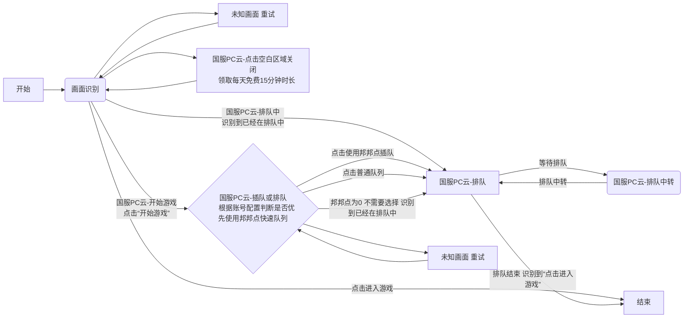

# 云游戏适配文档

本文档说明云游戏启动、排队和进入游戏流程的实现落点。

## 1. 核心流程：云游戏排队

云游戏排队不再作为独立 `Application` 注册，排队能力内置在进入游戏流程中。

### 主要逻辑 (`cloud_game_queue.py`)

`CloudGameQueue` 位于 `src/zzz_od/operation/enter_game/cloud_game_queue.py`，只作为 `OpenAndEnterGame` 内部节点调用。

下图展示了 `CloudGameQueue` 操作类中各个节点的跳转流程。

```mermaid
graph LR
    A[开始] --> B(画面识别);
    B --> H[未知画面 重试];
    H --> B;
    B --> G["国服PC云-点击空白区域关闭
    领取每天免费15分钟时长"];
    G --> B;
    B -- "国服PC云-开始游戏
    点击“开始游戏”" --> C{国服PC云-插队或排队
    根据账号配置判断是否优先使用邦邦点快速队列};
    B -- "国服PC云-排队中
    识别到已经在排队中" --> D[国服PC云-排队];
    B -- "点击进入游戏" --> E[结束];

    C --> I[未知画面 重试];
    I --> C;
    C -- "点击使用邦邦点插队" --> D;
    C -- "点击普通队列" --> D;
    C -- "邦邦点为0 不需要选择 识别到已经在排队中" --> D;

    D -- "等待排队" --> F(国服PC云-排队中转);
    D -- "排队结束 识别到“点击进入游戏”" --> E;
    F -- "排队中转" --> D;
```

## 2. 配置与上下文

### 游戏账户配置 (`game_account_config.py`)

- `client_type` 用于区分本地游戏和云游戏。
- `is_cloud_game` 根据 `client_type` 判断当前实例是否为云游戏。
- `game_path` 在云游戏模式下返回 `cloud_game_path`，否则返回 `local_game_path`。
- `prefer_bangbang_points` 作为账号实例级配置，决定云排队时是否优先选择邦邦点快速队列。

### 上下文扩展 (`zzz_context.py`)

- 窗口标题统一由 `_get_win_title()` 生成。
- 自定义窗口标题优先级最高。
- 云游戏国服和 B 服默认识别 `云·绝区零`，其他区服默认识别 `ZenlessZoneZero · Cloud`。
- `init_controller()` 使用同一套标题生成逻辑，避免云游戏标题被普通本地标题覆盖。

## 3. 对现有流程的适配

### 通用窗口检查 (`operation.py`)

`Operation.check_game_window()` 仍是所有需要检查游戏窗口的基础入口，底层基于 `ctx.controller.is_game_window_ready` 判断窗口是否存在。窗口不存在时会进入 `OpenAndEnterGame`。

### 绝区零窗口检查 (`zzz_operation.py`)

`ZOperation.check_game_window()` 在基础窗口判断之上增加云游戏未进入状态识别：

- 非云游戏沿用普通窗口已就绪逻辑。
- 云游戏窗口存在时，会截图识别云游戏外壳和进入前状态，包括“切换窗口”“开始游戏”“排队中”“邦邦点快速队列”“普通队列”“点击进入游戏”等。
- 如果识别到这些进入前画面，则返回未就绪，让基础 `Operation` 流程进入 `OpenAndEnterGame` 处理排队和进入游戏。
- 不再在 `check_game_initialized()` 中直接执行排队操作，避免每个业务操作重复阻塞运行 `CloudGameQueue`。

### 打开并进入游戏 (`open_and_enter_game.py`)

`OpenAndEnterGame` 的流程为：

1. `打开游戏`：云游戏模式下先检查云游戏窗口是否已经打开，已打开则跳过启动，避免二次启动客户端。
2. `等待游戏打开`：轮询初始化窗口，窗口就绪后激活窗口。
3. `云游戏排队`：仅云游戏模式执行 `CloudGameQueue`；非云游戏直接通过。
4. `进入游戏`：执行 `EnterGame`，识别并点击“点击进入游戏”，然后处理进入大世界前的弹窗。

### 进入游戏操作 (`enter_game.py`)

云游戏只支持已登录的单实例场景。检测到云游戏时，进入游戏操作会跳过账号密码输入逻辑：

- `force_login = False`
- `already_login = True`

## 4. 界面调整

账号实例配置中保留云游戏相关选项：

- 云游戏路径。
- 是否使用云游戏客户端。
- 是否优先使用邦邦点快速队列。

## 5. 屏幕识别数据

云游戏识别数据位于 `assets/game_data/screen_info/cloud_game.yml`。

该文件定义了云游戏排队界面中的关键区域，如“开始游戏”“排队中”“排队人数”“预计等待时间”等，供 `CloudGameQueue` 和 `ZOperation.check_game_window()` 使用。
