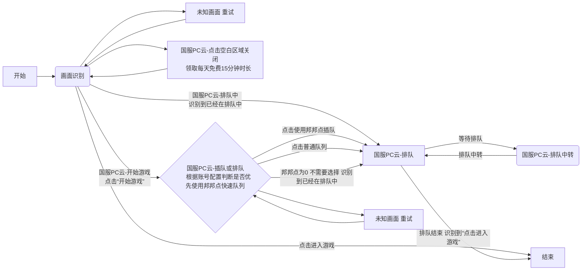

# 云游戏适配文档

本文档说明云游戏启动、排队、进入游戏、窗口检查和关闭游戏流程的实现落点。

## 1. 核心流程：云游戏排队

云游戏排队不作为独立 `Application` 注册，排队能力内置在 `OpenAndEnterGame` 的 `云游戏排队` 节点中。普通本地游戏不会执行该节点的排队逻辑。

### 主要逻辑 (`cloud_game_queue.py`)

`CloudGameQueue` 位于 `src/zzz_od/operation/enter_game/cloud_game_queue.py`，继承 `ZOperation`，构造时设置 `need_check_game_win=False`，只作为 `OpenAndEnterGame` 的内部操作调用。

`画面识别` 节点会先识别 `国服PC云-切换窗口`，用它确认当前是云游戏外壳画面；识别失败时按未知画面重试。确认云游戏外壳后，依次处理：

- `国服PC云-点击空白区域关闭`：关闭领取每天免费 15 分钟时长等遮挡提示。
- `国服PC云-排队中`：已经在排队时直接进入等待队列节点。
- `国服PC云-开始游戏`：点击后进入“插队或排队”节点。
- `打开游戏 / 点击进入游戏`：排队结束或已经可进入游戏时直接结束 `CloudGameQueue`，交给后续 `EnterGame` 点击进入。

下图展示了 `CloudGameQueue` 操作类中各个节点的跳转流程。

```mermaid
graph LR
    A[开始] --> B(画面识别);
    B --> H[未知画面 重试];
    H --> B;
    B --> G["国服PC云-点击空白区域关闭
    领取每天免费15分钟时长"];
    G --> B;
    B -- "国服PC云-开始游戏
    点击“开始游戏”" --> C{国服PC云-插队或排队
    根据账号配置判断是否优先使用邦邦点快速队列};
    B -- "国服PC云-排队中
    识别到已经在排队中" --> D[国服PC云-排队];
    B -- "点击进入游戏" --> E[结束];

    C --> I[未知画面 重试];
    I --> C;
    C -- "点击使用邦邦点插队" --> D;
    C -- "点击普通队列" --> D;
    C -- "邦邦点为0 不需要选择 识别到已经在排队中" --> D;

    D -- "等待排队" --> F(国服PC云-排队中转);
    D -- "排队结束 识别到“点击进入游戏”" --> E;
    F -- "排队中转" --> D;
```

### 插队与普通队列

`cn_pc_cloud_start_or_queue()` 负责处理点击“开始游戏”后的队列选择：

- 识别到 `国服PC云-邦邦点快速队列` 且 `prefer_bangbang_points=True` 时，点击邦邦点快速队列。
- 识别到 `国服PC云-邦邦点快速队列` 且 `prefer_bangbang_points=False` 时，点击普通队列。
- 没有邦邦点选择但已识别到 `国服PC云-排队中` 时，直接进入排队等待。

`cn_pc_cloud_queue()` 会 OCR `国服PC云-排队人数` 和 `国服PC云-预计等待时间`，只用于日志输出；真正的结束条件是识别到 `打开游戏 / 点击进入游戏`。

## 2. 配置与上下文

### 游戏账户配置 (`game_account_config.py`)

- `ClientTypeEnum` 提供 `local` 和 `cloud` 两种客户端类型。
- `client_type` 用于区分本地游戏和云游戏，默认是本地游戏。
- `is_cloud_game` 根据 `client_type == "cloud"` 判断当前实例是否为云游戏。
- `local_game_path` 保存本地游戏路径，`cloud_game_path` 保存云游戏客户端路径。
- `game_path` 是兼容入口：云游戏模式下返回或写入 `cloud_game_path`，否则返回或写入 `local_game_path`。
- 初始化配置时会兼容旧键 `game_path`：如果旧配置存在且 `local_game_path` 为空，会迁移到 `local_game_path`。
- `prefer_bangbang_points` 作为账号实例级配置，决定云排队时是否优先选择邦邦点快速队列。

### 上下文扩展 (`zzz_context.py`)

- 窗口标题统一由 `_get_win_title()` 生成。
- 自定义窗口标题优先级最高。
- 国服和 B 服云游戏默认识别 `云·绝区零`，其他区服云游戏默认识别 `ZenlessZoneZero · Cloud`。
- 非云游戏国服和 B 服默认识别 `绝区零`，其他区服默认识别 `ZenlessZoneZero`。
- `reload_instance_config()` 清理实例级缓存后调用 `on_switch_instance()`，让 `client_type` 或路径等实例配置变化后同步刷新 controller 窗口标题。
- `init_controller()` 创建 `ZPcController` 时传入 `_get_win_title()` 结果，并在创建后再次 `set_window_title()`，避免云游戏标题被普通本地标题覆盖。

## 3. 对现有流程的适配

### 通用窗口检查 (`operation.py`)

`Operation._add_check_game_node()` 会在业务起始节点前增加 `检测游戏窗口` 和 `打开并进入游戏`。`Operation.check_game_window()` 底层只判断 `ctx.controller.is_game_window_ready`，窗口不存在时返回失败，并进入 `OpenAndEnterGame`。

### 绝区零窗口检查 (`zzz_operation.py` / `zzz_application.py`)

`ZOperation.check_game_window()` 和 `ZApplication.check_game_window()` 在基础窗口判断之上增加云游戏未进入状态识别：

- controller 为空或窗口不存在时，返回 `未打开游戏窗口`。
- 非云游戏沿用普通窗口已就绪逻辑，直接进入 `check_game_initialized()`。
- 云游戏窗口存在时，会截图识别云游戏外壳和进入前状态，包括“切换窗口”“开始游戏”“排队中”“邦邦点快速队列”“普通队列”“点击进入游戏”等。
- 如果识别到这些进入前画面，则返回未就绪，让基础 `Operation` 流程进入 `OpenAndEnterGame` 处理排队和进入游戏。
- `ZApplication` 覆写该检查后，邮件、咖啡等应用在起始节点前也会先处理云游戏排队和进入游戏流程。
- 不再在 `check_game_initialized()` 中直接执行排队操作，避免每个业务操作重复阻塞运行 `CloudGameQueue`。

`ZOperation` 和 `ZApplication` 当前各自维护一份 `CLOUD_GAME_NOT_ENTERED_AREA_LIST`，需要新增云游戏进入前画面时同步更新两处。

### 打开并进入游戏 (`open_and_enter_game.py`)

`OpenAndEnterGame` 的流程为：

1. `打开游戏`：云游戏模式下先 `init_game_win()` 检查云游戏窗口是否已经打开，已打开则跳过启动，避免二次启动客户端；否则执行 `DisableAutoHDR` 和 `OpenGame`。
2. `等待游戏打开`：轮询初始化窗口，窗口就绪后激活窗口，并执行 `EnableAutoHDR`。
3. `云游戏排队`：仅云游戏模式执行 `CloudGameQueue`；非云游戏直接通过。
4. `进入游戏`：执行 `EnterGame`，识别并点击“点击进入游戏”，然后处理进入大世界前的弹窗。

### 启动游戏 (`open_game.py`)

`OpenGame` 仍通过 `ctx.game_account_config.game_path` 获取启动路径。由于 `game_path` 已按 `client_type` 分流，云游戏模式下会启动 `cloud_game_path`，本地游戏模式下会启动 `local_game_path`。

### 进入游戏操作 (`enter_game.py`)

云游戏只支持已登录的单实例场景。检测到云游戏时，进入游戏操作会跳过账号密码输入和强制切号逻辑：

- `force_login = False`
- `already_login = True`

因此云游戏流程只负责从云游戏外壳排队并点击“进入游戏”，不负责在云游戏客户端内登录或切换米哈游账号。

### 关闭游戏 (`zzz_pc_controller.py`)

`ZPcController.close_game()` 覆写了基础 controller 的关闭逻辑：

- 先通过当前游戏窗口句柄获取进程 PID。
- 获取 PID 失败时，回退到 `PcControllerBase.close_game()` 的窗口关闭逻辑。
- 获取 PID 成功时，执行 `taskkill /F /PID <pid>` 强制结束对应进程。
- `taskkill` 失败时，再回退到基础窗口关闭逻辑。

这个实现对云游戏更稳：云游戏窗口关闭按钮不一定等价于客户端进程完全退出，而多实例切换、运行结束关闭游戏等入口最终都会走 controller 的 `close_game()`。

## 4. 界面调整

账号实例配置位于 `src/one_dragon_qt/view/setting/setting_instance_interface.py`，当前账户设置中保留云游戏相关选项：

- `游戏客户端`：绑定 `client_type`，可选本地游戏或云游戏。
- `邦邦点快速队列`：绑定 `prefer_bangbang_points`。
- `游戏路径`：显示和写入 `game_account_config.game_path`，因此会随 `client_type` 自动指向本地或云游戏路径。

切换 `游戏客户端` 后，界面会刷新当前显示的路径，并调用 `ctx.on_switch_instance()` 更新 controller 的窗口标题。选择路径时仍只选择 `.exe`，云游戏模式下该路径会写入 `cloud_game_path`。

## 5. 屏幕识别数据

云游戏识别数据位于 `assets/game_data/screen_info/cloud_game.yml`。

该文件定义了云游戏排队界面中的关键区域，如“开始游戏”“排队中”“切换窗口”“点击空白区域关闭”“邦邦点快速队列”“普通队列”“排队人数”“预计等待时间”等，供 `CloudGameQueue`、`ZOperation.check_game_window()` 和 `ZApplication.check_game_window()` 使用。

`点击进入游戏` 仍来自打开游戏相关 screen info，即代码中使用的 `("打开游戏", "点击进入游戏")`。

## 6. 当前限制与维护点

- 云游戏只处理已登录客户端，不实现账号密码输入、验证码或云游戏账号切换。
- 目前云游戏识别区域名称以 `国服PC云-*` 为主，新增其他区服或不同客户端界面时，需要补充 `assets/game_data/screen_info/cloud_game.yml` 和窗口未进入状态列表。
- `ZOperation` 与 `ZApplication` 的云游戏未进入状态列表存在重复，新增状态时需要同步维护，避免普通操作和应用级操作行为不一致。
- `temp_close_cloud_zzz.py` 是临时验证脚本，不属于主流程；正式关闭入口以 `ZPcController.close_game()` 为准。
