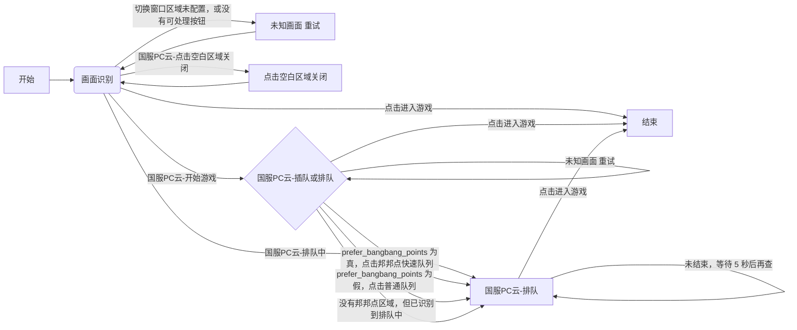

# 云游戏适配文档

本文档说明云游戏启动、排队、进入游戏、窗口检查和关闭游戏流程的实现落点。

## 1. 核心流程：云游戏排队

云游戏排队不作为独立 `Application` 注册，排队能力内置在 `OpenAndEnterGame` 的 `云游戏排队` 节点中。普通本地游戏不会执行该节点的排队逻辑。

### 主要逻辑 (`cloud_game_queue.py`)

`CloudGameQueue` 位于 `src/zzz_od/operation/enter_game/cloud_game_queue.py`，继承 `ZOperation`，构造时设置 `need_check_game_win=False`，只作为 `OpenAndEnterGame` 的内部操作调用。

`画面识别` 会先查找 `国服PC云-切换窗口`。只有这次查找失败（区域未配置）时，才立刻按未知画面重试。没找到这块区域不会停住，找到了也不作为后面识别的前提，接着按顺序处理：

- `国服PC云-点击空白区域关闭`：关闭领取每天免费 15 分钟时长等遮挡提示。
- `国服PC云-排队中`：已经在排队时直接进入等待队列节点。
- `国服PC云-开始游戏`：点击后进入“插队或排队”节点。
- `打开游戏 / 点击进入游戏`：排队结束或已经可进入游戏时直接结束 `CloudGameQueue`，交给后续 `EnterGame` 点击进入。

下图展示了 `CloudGameQueue` 操作类中各个节点的跳转流程。

```mermaid
graph LR
    A[开始] --> B(画面识别);
    B -- "切换窗口区域未配置，或没有可处理按钮" --> H[未知画面 重试];
    H --> B;
    B -- "国服PC云-点击空白区域关闭" --> G[点击空白区域关闭];
    G --> B;
    B -- "国服PC云-开始游戏" --> C{国服PC云-插队或排队};
    B -- "国服PC云-排队中" --> D[国服PC云-排队];
    B -- "点击进入游戏" --> E[结束];

    C -- "未知画面 重试" --> C;
    C -- "点击进入游戏" --> E;
    C -- "prefer_bangbang_points 为真，点击邦邦点快速队列" --> D;
    C -- "prefer_bangbang_points 为假，点击普通队列" --> D;
    C -- "没有邦邦点区域，但已识别到排队中" --> D;

    D -- "未结束，等待 5 秒后再查" --> D;
    D -- "点击进入游戏" --> E;
```

### 插队与普通队列

`cn_pc_cloud_start_or_queue()` 负责处理点击“开始游戏”后的队列选择。`prefer_bangbang_points` 来自 `game.yml`，代码不读取邦邦点余额：

- 先识别 `打开游戏 / 点击进入游戏`。已经能进入游戏时，直接结束 `CloudGameQueue`。
- 识别到 `国服PC云-邦邦点快速队列` 且 `prefer_bangbang_points=True` 时，点击邦邦点快速队列。
- 识别到 `国服PC云-邦邦点快速队列` 且 `prefer_bangbang_points=False` 时，点击普通队列。
- 没有 `国服PC云-邦邦点快速队列`，但已识别到 `国服PC云-排队中` 时，直接进入排队等待。

这个节点遇到未知画面最多重试 10 次。`画面识别` 的未知画面最多重试 60 次。

`cn_pc_cloud_queue()` 会 OCR `国服PC云-排队人数` 和 `国服PC云-预计等待时间`，只用于日志输出。结束条件同样是识别到 `打开游戏 / 点击进入游戏`。没结束时返回 `round_wait(status="等待排队", wait=5)`。框架遇到等待会留在 `国服PC云-排队`，5 秒后再查。源码声明了 `国服PC云-排队中转`，从本节点状态“等待排队”连到它的边只在成功时才会走；当前返回的是等待，所以进不去。中转节点自己也只返回等待，它回到排队节点的边同样要成功才会走。

### 同名窗口的 HWND 精准选择

云游戏客户端可能同时暴露多个标题相同的窗口，其中部分窗口通过截图接口只能得到黑图。窗口选择器由 `ZPcController` 持有。初始化检查和排队截图都调用 `ZPcController.cloud_game_screenshot()`。新建应用或子操作不会各自再建选择器。

`cloud_game_screenshot()` 平时用已缓存句柄做常规截图，只计算非黑像素比例，不枚举候选，不算对比度，也不评分。下面两种情况才调用 `CloudGameWindowSelector.select_window()`：

- 缓存句柄无效。窗口初始化、激活和就绪检查都进 `_ensure_game_window()`。第一次探测会立刻执行；之后受 1 秒探测间隔限制。
- 常规截图持续无效至少 1 秒。第一次无效只记录时间并让上层等待，避免加载时的短黑屏立刻重选。

选择器缓存已确认的 HWND。这套复用只在再次进入 `select_window()` 时发生：该 HWND 仍在标题完全一致的候选里，正式 controller 的缓存句柄没有被换掉，并且固定 `PrintWindow` 探测仍然有效，就直接复用。句柄消失、被替换，或这次探测无效时，重新给全部候选评分。

窗口选择规则如下：

- 按 controller 当前窗口标题调用系统窗口枚举，只接受标题完全一致的候选，避免部分标题匹配带入无关窗口。
- 只有一个候选时直接使用该 HWND，不执行黑屏评分。
- 有多个候选时，使用临时窗口对象和独立模式 `PrintWindow` 逐个截图。该探测方式固定，不受用户配置的常规截图方式影响，也不会在探测过程中修改正式 controller。
- 探测图像按 RGB 转灰度。灰度大于 `8` 的像素占比达到 `1%` 才算有效；以灰度标准差作为对比度，候选得分为“有效像素比例 + 对比度 / 255”，最终选择得分最高的有效候选。
- 所有候选均无效时不调用 `set_window_hwnd()`。`ZPcController._select_cloud_game_window()` 会清空已有窗口缓存，并在日志中记录每个候选的 HWND、有效像素比例、对比度和得分。

选中的句柄通过 `ZPcController.set_window_hwnd()` 写入 `PcGameWindow`。

`PcGameWindow.init_win()` 保留仍存在且实际标题与配置标题一致的缓存窗口，不因正常初始化或激活重新覆盖业务层选中的 HWND。句柄失效、实际标题不匹配或配置标题变化后才重新查找；重新查找前清空旧缓存，避免只有部分标题匹配时留下旧句柄。`refresh_win()` 会先清空缓存，再调用 `init_win()` 按标题重新枚举，取第一个标题完全一致的窗口。悬浮层 `OverlayManager._get_game_rect()` 第一次拿不到可用窗口矩形时会调用它，因此可能换掉云游戏选择器已经写入的句柄。

`ZPcController` 在 PC 云游戏模式下，缓存有效就直接返回；缓存无效时只走云游戏选择器。没有有效候选时返回未就绪。这条就绪检查不回退到普通标题枚举，也不会去激活这次失败的结果。前台 `sync_game_config()` 和 `ZApplication.handle_resume()` 都会调用 `active_window()`。缓存仍然有效时只激活已选窗口，不更换句柄。

`ZContext` 创建 controller 时传入 `is_cloud_game`。切换实例时 `on_switch_instance()` 调用 `sync_game_config()`。客户端类型变化会清空旧句柄、选择器和失效计时，自定义标题相同也要重选。前台模式在同一次同步里调用 `active_window()`，因此会马上重选；后台模式不在这里激活，等到下一次就绪检查再选。本地游戏走基类 `_ensure_game_window()`，缓存无效时按标题枚举。缓存有效时，本地游戏同样复用句柄。

相邻两次探测至少间隔 1 秒。窗口标题或客户端类型变化会清掉选择器、失效画面记录和探测间隔；只是句柄变化时，只清掉失效画面记录。重选成功后用常规截图再验一次，仍然无效就继续上层的等待。`CloudGameQueue` 不经过外层窗口检查：截图为空时从第一次失败计时，满 10 秒返回“未找到有效云游戏窗口”。初始化检查只有在窗口已经就绪、随后截图无效时才开始这 10 秒；窗口未就绪由外层当轮失败，不计这 10 秒。任意一次有效截图清空自己的计时。普通业务截图仍走 `controller.screenshot()`，不经过 `cloud_game_screenshot()`。

没有候选、多个候选全部无效，或常规截图无效时，`CloudGameQueue` 每秒等待。是否重选由 controller 按上面的规则决定。

通用框架只维护窗口缓存：有效则复用，失效或调用 `refresh_win()` 时按标题重新查找。候选枚举、黑屏判定和评分在 `ZPcController` 与 `CloudGameWindowSelector`。`init_win()` 的缓存保留对本地游戏同样生效；只有一个同名窗口时，结果和每次都枚举到这个窗口相同。

## 2. 配置与上下文

### 游戏账户配置 (`game_account_config.py`)

- `ClientTypeEnum` 提供 `local` 和 `cloud` 两种客户端类型。
- `client_type` 用于区分本地游戏和云游戏，默认是本地游戏。
- `is_cloud_game` 根据 `client_type == "cloud"` 判断当前实例是否为云游戏。
- `local_game_path` 保存本地游戏路径，`cloud_game_path` 保存云游戏客户端路径。
- `game_path` 是兼容入口：云游戏模式下返回或写入 `cloud_game_path`，否则返回或写入 `local_game_path`。这个属性读写的是这两个新键。
- 加载账号配置时，如果旧键 `game_path` 有值且 `local_game_path` 为空，会把旧值拷进 `local_game_path`。旧键留在 YAML 里。`local_game_path` 已经有值时不覆盖。

### 游戏配置 (`game_config.py`)

- `prefer_bangbang_points` 决定云排队时是否优先选择邦邦点快速队列，保存在 `game.yml`，默认 `False`。
- 旧版本写在 `game_account.yml` 的同名键。加载游戏配置时，只有 `game.yml` 里还没有这个键、且账号配置里仍有旧键，才会迁入 `game.yml` 并删除旧键。`game.yml` 已有该键时保留现有值。

### 上下文扩展 (`zzz_context.py`)

- 窗口标题统一由 `_get_win_title()` 生成。
- 自定义窗口标题优先级最高。
- 国服和 B 服云游戏默认识别 `云·绝区零`，其他区服云游戏默认识别 `ZenlessZoneZero · Cloud`。
- 非云游戏国服和 B 服默认识别 `绝区零`，其他区服默认识别 `ZenlessZoneZero`。
- `reload_instance_config()` 清理实例级缓存后调用 `on_switch_instance()`。后者按 `_get_win_title()` 设置窗口标题，并用 `sync_game_config()` 同步游戏配置和 `is_cloud_game`。只改游戏路径、且窗口标题不变时，不换句柄。窗口标题变化或客户端类型变化会清空句柄；类型变化后的重选规则见上一节。
- `init_controller()` 创建 `ZPcController` 时传入 `game_config`、截图方式、分辨率和 `is_cloud_game`。构造函数不接收窗口标题。创建完成后调用一次 `set_window_title(_get_win_title())`。

## 3. 对现有流程的适配

### 通用窗口检查 (`operation.py`)

`Operation._add_check_game_node()` 会在业务起始节点前增加 `检测游戏窗口` 和 `打开并进入游戏`。`Operation.check_game_window()` 判断 `ctx.controller.is_game_window_ready`。窗口就绪后调用 `check_game_initialized()`；未就绪时当轮返回失败，并进入 `OpenAndEnterGame`。云游戏没有有效候选，或多个候选全部无效，也是未就绪，不会在这里等 10 秒。

### 绝区零窗口检查 (`zzz_operation_mixin.py`)

`ZOperation` 和 `ZApplication` 都不重写 `check_game_window`。云游戏是否已经进入游戏，由两边共同继承的 `ZOperationMixin.check_game_initialized()` 判断：

- 非云游戏直接成功。
- PC 云游戏通过 controller 的云游戏截图入口复用选窗结果并获取常规截图，使用轻量非黑像素比例检查避免黑图误判；有效句柄和画面不会触发候选探测。
- 这一步只在窗口已经就绪后执行。截图失败、空图或黑图时，每秒等待并重新检查。连续失败达到 10 秒返回“未找到有效云游戏窗口”，沿框架失败边转入 `OpenAndEnterGame`；不会直接进入业务节点。同一次检查里，截图无效满 1 秒后重选仍失败，这一轮仍走这段计时。重选失败会清空缓存，下一轮外层看到未就绪会立刻失败，不再继续等满 10 秒。画面恢复、新一次执行或 controller 更换时清空操作的失败计时。窗口选择器和持续无效画面记录由 controller 统一维护，不再按操作创建选择器。
- 有效截图继续识别这些进入前区域：`国服PC云-点击空白区域关闭`、`国服PC云-排队中`、`国服PC云-开始游戏`、`国服PC云-邦邦点快速队列`、`国服PC云-普通队列`、`国服PC云-切换窗口`，以及 `打开游戏 / 点击进入游戏`。都没有命中时返回成功。
- controller 不是 `ZPcController` 时，不做 `cloud_game_screenshot()`，也不做这段 10 秒截图等待，改用普通 `screenshot()`，然后仍扫描同一份列表。
- 识别到这些进入前画面则返回失败，基础流程进入 `OpenAndEnterGame` 处理排队和进入游戏。邮件、咖啡等应用也走同一条检查。
- 不在这个检查里执行排队，避免每个业务操作都跑一遍 `CloudGameQueue`。

进入前画面集中在 mixin 的 `CLOUD_GAME_NOT_ENTERED_AREA_LIST`。新增画面时只改这一处。

初始化检查和排队的门槛不同。`check_game_initialized()` 命中列表中任意一块就失败。`CloudGameQueue` 的 `画面识别` 不要求先看到 `国服PC云-切换窗口`：这块区域未配置时按未知画面重试，没找到则继续识别后面的按钮。识别到 `点击进入游戏` 时，没有对应出边，排队会直接成功结束。

### 打开并进入游戏 (`open_and_enter_game.py`)

`OpenAndEnterGame` 有三个节点：

1. `打开游戏`：云游戏先 `init_game_win()`。窗口已就绪就直接成功，不启动客户端。未就绪才执行 `OpenGame`。本地客户端不检查窗口，直接执行 `OpenGame`。
2. `云游戏排队`：仅云游戏执行 `CloudGameQueue`；非云游戏直接成功。
3. `进入游戏`：执行 `EnterGame`。

云窗口已经打开时，不会跑 `OpenGame`，因此也不会禁用或恢复 HDR，也不会在这一步激活窗口。

### 启动游戏 (`open_game.py`)

`OpenGame` 有两个节点。云游戏模式下，`OpenAndEnterGame` 只在窗口尚未就绪时调用它。本地客户端每次都会调用：

1. `打开游戏`：先执行 `DisableAutoHDR`，再用 `ctx.game_account_config.game_path` 启动 exe。`game_path` 按 `client_type` 分流，云游戏启动 `cloud_game_path`，本地游戏启动 `local_game_path`。
2. `等待游戏打开`：最多重试 60 次。每秒调用 `init_game_win()`，窗口就绪后 `active_window()`，再执行 `EnableAutoHDR`。

### 进入游戏操作 (`enter_game.py`)

云游戏按已登录客户端处理。`EnterGame.__init__()` 在 `is_cloud_game` 时把 `force_login` 设为 `False`，把 `already_login` 设为 `True`。`handle_init()` 每次执行会按当前 `is_cloud_game` 重设 `already_login`，不改 `force_login`。

这两个值只跳过 `点击进入游戏` 节点中的强制切号，条件是 `force_login and not already_login`。`check_login_related()` 不看客户端类型，国服账号密码、登录其他账号等区域仍会识别；云游戏外壳上通常没有这些区域。

排队在前面的 `CloudGameQueue`。`EnterGame` 负责识别并点击“点击进入游戏”，再处理进入大世界前的弹窗。这里没有单独的云游戏账号密码、验证码或切号流程。

### 关闭游戏 (`zzz_pc_controller.py`)

`ZPcController.close_game()` 覆写了基础 controller 的关闭逻辑：

- 调用 `game_win.get_hwnd()`。缓存为空时，这个方法会 `init_win()`，按窗口标题枚举，不走云游戏选择器。
- 句柄为 `None` 时直接返回，不调用 `PcControllerBase.close_game()`。
- 用句柄查询 PID。PID 为 0 时回退到 `PcControllerBase.close_game()`。
- PID 有效时执行 `taskkill /F /PID <pid>`。命令失败再回退到基础窗口关闭。

云游戏用结束进程来关，窗口关闭按钮不一定会退出客户端进程。多实例切换、运行结束关闭游戏等入口调用的是 controller 的 `close_game()`。

## 4. 界面调整

账号实例配置位于 `src/one_dragon_qt/view/setting/setting_instance_interface.py`，账户设置中保留云游戏客户端和路径：

- `游戏客户端`：绑定 `client_type`，可选本地游戏或云游戏。
- `游戏路径`：显示和写入 `game_account_config.game_path`，因此会随 `client_type` 自动指向本地或云游戏路径。

切换 `游戏客户端` 后，界面会刷新当前显示的路径，并调用 `ctx.on_switch_instance()` 更新 controller 的窗口标题。选择路径时仍只选择 `.exe`，云游戏模式下该路径会写入 `cloud_game_path`。

邦邦点开关在游戏设置 `src/zzz_od/gui/view/setting/setting_game_interface.py`。「云游戏」分组放在「游戏基础」下面，`邦邦点快速队列` 绑定 `game_config.prefer_bangbang_points`。

## 5. 屏幕识别数据

云游戏识别数据位于 `assets/game_data/screen_info/cloud_game.yml`。

该文件定义了云游戏排队界面中的关键区域，如“开始游戏”“排队中”“切换窗口”“点击空白区域关闭”“邦邦点快速队列”“普通队列”“排队人数”“预计等待时间”等，供 `CloudGameQueue` 和 `ZOperationMixin.check_game_initialized()` 使用。

`点击进入游戏` 仍来自打开游戏相关 screen info，即代码中使用的 `("打开游戏", "点击进入游戏")`。

## 6. 当前限制与维护点

### 手动检查同名窗口截图

在主仓根目录运行 `uv run --env-file .env python zzz-od-test/test/manual_print_cloud_zzz_hwnd.py`。脚本等待 3 秒后，枚举所有标题完全匹配的窗口，打印各窗口的 HWND 和客户区位置，并分别使用 PrintWindow、BitBlt、PIL 保存截图。MSS 已移除，不再使用。

默认标题为 `云·绝区零`，其他标题可修改脚本中的 `WINDOW_TITLE`。脚本先调用正式云游戏窗口选择器，输出候选的非黑像素比例、对比度、评分、有效性和最终选中的 HWND；无有效候选时明确输出未选择。只有一个候选时，正式规则直接选择该窗口，脚本额外打印探测评分供检查，不改变选择结果。评分基于独立 PrintWindow 探测，与后续保存的各截图方式分开执行，画面变化时可能不同。脚本使用独立 controller，不改变正在运行的应用所用窗口，也不判断是否已进入游戏。

图片保存到测试仓的 `test/window_captures/`，文件名包含 HWND 和截图方式，该目录不提交到 Git。BitBlt 和 PIL 截取桌面上的窗口区域，窗口被遮挡时可能截到遮挡内容；比较同名窗口自身的渲染画面时，以 PrintWindow 图片为主。

- 云游戏按已登录的单个客户端使用。强制切号由 `force_login=False` 和 `already_login=True` 跳过。没有单独的云游戏登录、验证码或切号流程；`EnterGame.check_login_related()` 仍会识别本地登录区域。
- 目前云游戏识别区域名称以 `国服PC云-*` 为主，新增其他区服或不同客户端界面时，需要补充 `assets/game_data/screen_info/cloud_game.yml` 和窗口未进入状态列表。
- `ZOperation` 与 `ZApplication` 共用 mixin 的云游戏初始化检查和未进入状态列表，新增状态时统一维护该列表。
- 正式关闭入口是 `ZPcController.close_game()`。缓存为空时它会按标题找窗口；找到进程后用 `taskkill` 结束。
