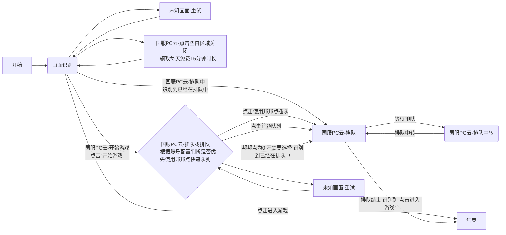

# 云游戏适配文档

本文档说明云游戏启动、排队、进入游戏、窗口检查和关闭游戏流程的实现落点。

## 1. 核心流程：云游戏排队

云游戏排队不作为独立 `Application` 注册，排队能力内置在 `OpenAndEnterGame` 的 `云游戏排队` 节点中。普通本地游戏不会执行该节点的排队逻辑。

### 主要逻辑 (`cloud_game_queue.py`)

`CloudGameQueue` 位于 `src/zzz_od/operation/enter_game/cloud_game_queue.py`，继承 `ZOperation`，构造时设置 `need_check_game_win=False`，只作为 `OpenAndEnterGame` 的内部操作调用。

`画面识别` 节点会先识别 `国服PC云-切换窗口`，用它确认当前是云游戏外壳画面；识别失败时按未知画面重试。确认云游戏外壳后，依次处理：

- `国服PC云-点击空白区域关闭`：关闭领取每天免费 15 分钟时长等遮挡提示。
- `国服PC云-排队中`：已经在排队时直接进入等待队列节点。
- `国服PC云-开始游戏`：点击后进入“插队或排队”节点。
- `打开游戏 / 点击进入游戏`：排队结束或已经可进入游戏时直接结束 `CloudGameQueue`，交给后续 `EnterGame` 点击进入。

下图展示了 `CloudGameQueue` 操作类中各个节点的跳转流程。

```mermaid
graph LR
    A[开始] --> B(画面识别);
    B --> H[未知画面 重试];
    H --> B;
    B --> G["国服PC云-点击空白区域关闭
    领取每天免费15分钟时长"];
    G --> B;
    B -- "国服PC云-开始游戏
    点击“开始游戏”" --> C{国服PC云-插队或排队
    根据账号配置判断是否优先使用邦邦点快速队列};
    B -- "国服PC云-排队中
    识别到已经在排队中" --> D[国服PC云-排队];
    B -- "点击进入游戏" --> E[结束];

    C --> I[未知画面 重试];
    I --> C;
    C -- "点击使用邦邦点插队" --> D;
    C -- "点击普通队列" --> D;
    C -- "邦邦点为0 不需要选择 识别到已经在排队中" --> D;

    D -- "等待排队" --> F(国服PC云-排队中转);
    D -- "排队结束 识别到“点击进入游戏”" --> E;
    F -- "排队中转" --> D;
```

### 插队与普通队列

`cn_pc_cloud_start_or_queue()` 负责处理点击“开始游戏”后的队列选择：

- 识别到 `国服PC云-邦邦点快速队列` 且 `prefer_bangbang_points=True` 时，点击邦邦点快速队列。
- 识别到 `国服PC云-邦邦点快速队列` 且 `prefer_bangbang_points=False` 时，点击普通队列。
- 没有邦邦点选择但已识别到 `国服PC云-排队中` 时，直接进入排队等待。

`cn_pc_cloud_queue()` 会 OCR `国服PC云-排队人数` 和 `国服PC云-预计等待时间`，只用于日志输出；真正的结束条件是识别到 `打开游戏 / 点击进入游戏`。

### 同名窗口的 HWND 精准选择

云游戏客户端可能同时暴露多个标题相同的窗口，其中部分窗口通过截图接口只能得到黑图。窗口选择器统一由 `ZPcController` 持有，初始化检查和排队截图共用 controller 的云游戏截图入口。首次使用、句柄失效或标题变化时选择窗口，正常截图沿用有效句柄，不因新建应用或子操作重新探测候选。

窗口选择规则如下：

- 按 controller 当前窗口标题调用系统窗口枚举，只接受标题完全一致的候选，避免部分标题匹配带入无关窗口。
- 只有一个候选时直接使用该 HWND，不执行黑屏评分。
- 有多个候选时，使用临时窗口对象和独立模式 `PrintWindow` 逐个截图。该探测方式固定，不受用户配置的常规截图方式影响，也不会在探测过程中修改正式 controller。
- 探测图像按 RGB 转灰度。灰度大于 `8` 的像素占比达到 `1%` 才算有效；以灰度标准差作为对比度，候选得分为“有效像素比例 + 对比度 / 255”，最终选择得分最高的有效候选。
- 所有候选均无效时不向 controller 注入 HWND，并在日志中记录每个候选的 HWND、有效像素比例、对比度和得分。

选择器会缓存已经确认的 HWND。后续截图时，如果该 HWND 仍在候选列表中、正式 controller 没有被其他逻辑替换句柄，并且固定 `PrintWindow` 探测仍有效，就直接复用；句柄消失、被替换或探测画面变黑时，重新评分全部候选。最终选中的句柄统一通过 `PcControllerBase.set_window_hwnd()` 注入。

`PcGameWindow.init_win()` 保留仍存在且实际标题与配置标题一致的缓存窗口，不因正常初始化或激活重新覆盖业务层选中的 HWND。句柄失效、实际标题不匹配或配置标题变化后才重新查找；重新查找前清空旧缓存，避免只有部分标题匹配时留下旧句柄。显式 `refresh_win()` 仍表示强制清空并重新枚举。

controller 的窗口初始化、激活和就绪检查共用 `_ensure_game_window()`。`ZPcController` 在 PC 云游戏模式下，缓存无效时调用云游戏选择器重新选择；没有有效候选时返回未就绪，不回退到普通标题枚举，也不激活无效窗口。暂停恢复及前台配置同步因此不会覆盖已选窗口。`ZContext` 创建 controller 和切换实例时同步客户端类型；类型变化时清空旧句柄和选择器，即使自定义标题相同也重新选择。本地游戏继续使用通用标题枚举规则。

正常初始化检查和排队截图只对已有截图计算非黑像素比例，不额外截图、不计算对比度和评分。首次无效画面返回等待，持续无效至少 1 秒后才重新探测候选，以免游戏加载时短暂黑屏触发选窗。探测尝试至少间隔 1 秒，避免同一 controller 被多个入口连续调用时重复探测。新标题、客户端类型或句柄变化后重置旧画面的失败记录。重选后重新验证常规截图，仍然无效则继续原有等待和 10 秒超时流程；不修改普通业务截图入口。

没有候选、多个候选全部黑屏，或常规截图无效时，`CloudGameQueue` 每秒等待有效画面，是否重选由 controller 按上述规则决定。连续失败从首次失败开始计时，达到 `10` 秒后以“未找到有效云游戏窗口”明确失败；任意一次有效截图都会清空计时。

职责边界保持不变：通用框架只维护和使用 controller 中的窗口缓存，不承担云游戏候选枚举、黑屏判定或评分选择；这些规则全部属于云游戏业务层。本地游戏流程、窗口标题生成、截图框架、配置 YAML 和画面区域数据均不受影响。

## 2. 配置与上下文

### 游戏账户配置 (`game_account_config.py`)

- `ClientTypeEnum` 提供 `local` 和 `cloud` 两种客户端类型。
- `client_type` 用于区分本地游戏和云游戏，默认是本地游戏。
- `is_cloud_game` 根据 `client_type == "cloud"` 判断当前实例是否为云游戏。
- `local_game_path` 保存本地游戏路径，`cloud_game_path` 保存云游戏客户端路径。
- `game_path` 是兼容入口：云游戏模式下返回或写入 `cloud_game_path`，否则返回或写入 `local_game_path`。

### 游戏配置 (`game_config.py`)

- `prefer_bangbang_points` 决定云排队时是否优先选择邦邦点快速队列，保存在 `game.yml`。
- 旧版本写在 `game_account.yml` 的同名键，会在加载游戏配置时迁入 `game.yml`，并删除旧键。

### 上下文扩展 (`zzz_context.py`)

- 窗口标题统一由 `_get_win_title()` 生成。
- 自定义窗口标题优先级最高。
- 国服和 B 服云游戏默认识别 `云·绝区零`，其他区服云游戏默认识别 `ZenlessZoneZero · Cloud`。
- 非云游戏国服和 B 服默认识别 `绝区零`，其他区服默认识别 `ZenlessZoneZero`。
- `reload_instance_config()` 清理实例级缓存后调用 `on_switch_instance()`，让 `client_type` 或路径等实例配置变化后同步刷新 controller 窗口标题。
- `init_controller()` 创建 `ZPcController` 时传入 `_get_win_title()` 结果，并在创建后再次 `set_window_title()`，避免云游戏标题被普通本地标题覆盖。

## 3. 对现有流程的适配

### 通用窗口检查 (`operation.py`)

`Operation._add_check_game_node()` 会在业务起始节点前增加 `检测游戏窗口` 和 `打开并进入游戏`。`Operation.check_game_window()` 判断 `ctx.controller.is_game_window_ready`。窗口就绪后调用 `check_game_initialized()`；窗口不存在时返回失败，并进入 `OpenAndEnterGame`。

### 绝区零窗口检查 (`zzz_operation_mixin.py`)

`ZOperation` 和 `ZApplication` 都不重写 `check_game_window`。云游戏是否已经进入游戏，由两边共同继承的 `ZOperationMixin.check_game_initialized()` 判断：

- 非云游戏直接成功。
- PC 云游戏通过 controller 的云游戏截图入口复用选窗结果并获取常规截图，使用轻量非黑像素比例检查避免黑图误判；有效句柄和画面不会触发候选探测。
- 没有有效候选、截图失败、空图或黑图时，每秒等待并重新检查。连续失败达到 10 秒返回“未找到有效云游戏窗口”，沿框架失败边转入 `OpenAndEnterGame` 恢复流程；不会直接进入业务节点。画面恢复、新一次执行或 controller 更换时清空操作的失败计时。窗口选择器和持续无效画面记录由 controller 统一维护，不再按操作创建选择器。
- 有效截图继续识别外壳和进入前状态，包括“切换窗口”“开始游戏”“排队中”“邦邦点快速队列”“普通队列”“点击进入游戏”等。没有命中这些区域时沿用原来的成功判断；非 PC controller 保持原有识别流程。
- 识别到这些进入前画面则返回失败，基础流程进入 `OpenAndEnterGame` 处理排队和进入游戏。邮件、咖啡等应用也走同一条检查。
- 不在这个检查里执行排队，避免每个业务操作都跑一遍 `CloudGameQueue`。

进入前画面集中在 mixin 的 `CLOUD_GAME_NOT_ENTERED_AREA_LIST`。新增画面时只改这一处。

### 打开并进入游戏 (`open_and_enter_game.py`)

`OpenAndEnterGame` 的流程为：

1. `打开游戏`：云游戏模式下先 `init_game_win()` 检查云游戏窗口是否已经打开，已打开则跳过启动，避免二次启动客户端；否则执行 `DisableAutoHDR` 和 `OpenGame`。
2. `等待游戏打开`：轮询初始化窗口，窗口就绪后激活窗口，并执行 `EnableAutoHDR`。
3. `云游戏排队`：仅云游戏模式执行 `CloudGameQueue`；非云游戏直接通过。
4. `进入游戏`：执行 `EnterGame`，识别并点击“点击进入游戏”，然后处理进入大世界前的弹窗。

### 启动游戏 (`open_game.py`)

`OpenGame` 仍通过 `ctx.game_account_config.game_path` 获取启动路径。由于 `game_path` 已按 `client_type` 分流，云游戏模式下会启动 `cloud_game_path`，本地游戏模式下会启动 `local_game_path`。

### 进入游戏操作 (`enter_game.py`)

云游戏只支持已登录的单实例场景。检测到云游戏时，进入游戏操作会跳过账号密码输入和强制切号逻辑：

- `force_login = False`
- `already_login = True`

因此云游戏流程只负责从云游戏外壳排队并点击“进入游戏”，不负责在云游戏客户端内登录或切换米哈游账号。

### 关闭游戏 (`zzz_pc_controller.py`)

`ZPcController.close_game()` 覆写了基础 controller 的关闭逻辑：

- 先通过当前游戏窗口句柄获取进程 PID。
- 获取 PID 失败时，回退到 `PcControllerBase.close_game()` 的窗口关闭逻辑。
- 获取 PID 成功时，执行 `taskkill /F /PID <pid>` 强制结束对应进程。
- `taskkill` 失败时，再回退到基础窗口关闭逻辑。

这个实现对云游戏更稳：云游戏窗口关闭按钮不一定等价于客户端进程完全退出，而多实例切换、运行结束关闭游戏等入口最终都会走 controller 的 `close_game()`。

## 4. 界面调整

账号实例配置位于 `src/one_dragon_qt/view/setting/setting_instance_interface.py`，账户设置中保留云游戏客户端和路径：

- `游戏客户端`：绑定 `client_type`，可选本地游戏或云游戏。
- `游戏路径`：显示和写入 `game_account_config.game_path`，因此会随 `client_type` 自动指向本地或云游戏路径。

切换 `游戏客户端` 后，界面会刷新当前显示的路径，并调用 `ctx.on_switch_instance()` 更新 controller 的窗口标题。选择路径时仍只选择 `.exe`，云游戏模式下该路径会写入 `cloud_game_path`。

邦邦点开关在游戏设置 `src/zzz_od/gui/view/setting/setting_game_interface.py`。「云游戏」分组放在「游戏基础」下面，`邦邦点快速队列` 绑定 `game_config.prefer_bangbang_points`。

## 5. 屏幕识别数据

云游戏识别数据位于 `assets/game_data/screen_info/cloud_game.yml`。

该文件定义了云游戏排队界面中的关键区域，如“开始游戏”“排队中”“切换窗口”“点击空白区域关闭”“邦邦点快速队列”“普通队列”“排队人数”“预计等待时间”等，供 `CloudGameQueue` 和 `ZOperationMixin.check_game_initialized()` 使用。

`点击进入游戏` 仍来自打开游戏相关 screen info，即代码中使用的 `("打开游戏", "点击进入游戏")`。

## 6. 当前限制与维护点

### 手动检查同名窗口截图

在主仓根目录运行 `uv run --env-file .env python zzz-od-test/test/manual_print_cloud_zzz_hwnd.py`。脚本等待 3 秒后，枚举所有标题完全匹配的窗口，打印各窗口的 HWND 和客户区位置，并分别使用 PrintWindow、BitBlt、PIL 保存截图。MSS 已移除，不再使用。

默认标题为 `云·绝区零`，其他标题可修改脚本中的 `WINDOW_TITLE`。脚本先调用正式云游戏窗口选择器，输出候选的非黑像素比例、对比度、评分、有效性和最终选中的 HWND；无有效候选时明确输出未选择。只有一个候选时，正式规则直接选择该窗口，脚本额外打印探测评分供检查，不改变选择结果。评分基于独立 PrintWindow 探测，与后续保存的各截图方式分开执行，画面变化时可能不同。脚本使用独立 controller，不改变正在运行的应用所用窗口，也不判断是否已进入游戏。

图片保存到测试仓的 `test/window_captures/`，文件名包含 HWND 和截图方式，该目录不提交到 Git。BitBlt 和 PIL 截取桌面上的窗口区域，窗口被遮挡时可能截到遮挡内容；比较同名窗口自身的渲染画面时，以 PrintWindow 图片为主。

- 云游戏只处理已登录客户端，不实现账号密码输入、验证码或云游戏账号切换。
- 目前云游戏识别区域名称以 `国服PC云-*` 为主，新增其他区服或不同客户端界面时，需要补充 `assets/game_data/screen_info/cloud_game.yml` 和窗口未进入状态列表。
- `ZOperation` 与 `ZApplication` 共用 mixin 的云游戏初始化检查和未进入状态列表，新增状态时统一维护该列表。
- `temp_close_cloud_zzz.py` 是临时验证脚本，不属于主流程；正式关闭入口以 `ZPcController.close_game()` 为准。
