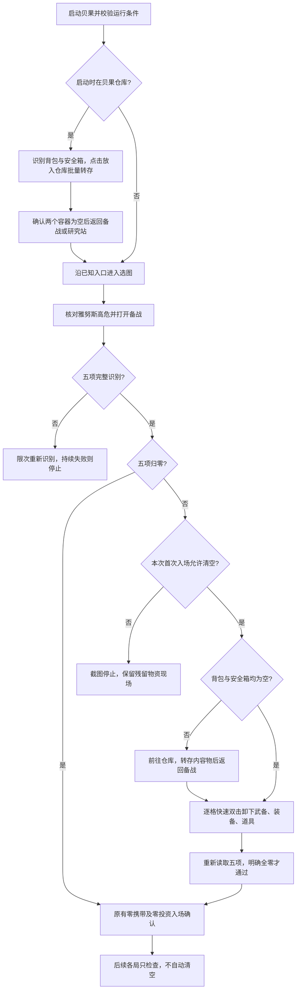

# 贝果启动时自动清空战备

用户启动贝果时，如果身上有战备，先读取背包和安全箱占用：两者均为空时直接在备战逐件快速双击卸装；任一个非空时，先去仓库批量转存内容物，再返回备战卸装。最后核对零携带并入场。双击时序依据与验证范围见下文。

现有流程见 [贝果自动化](bagel.md)，游戏机制见 [备战物资与仓储](../../../game/gameplay/贝果计划.md#备战物资与仓储)，归档画面见 [启动清空相关画面](../../../game/screens/贝果计划.md#启动清空相关画面)。

## 已确认的行为

| 情况 | 处理 |
| --- | --- |
| 每次用户重新启动贝果，首次入场前有携带物 | 允许清空；每次启动独立判断，不记住上次的授权或进度 |
| 启动时停在结算仓库 | 允许先转存遗留物资，再回入口核对地图、难度及备战；不计成功局数 |
| 上次清空中断，重新启动时仍在非结算仓库 | 先处理剩余物品，再点左上返回；识别上一页后重新走选图核验 |
| 同一次运行内自动重开或进入下一局 | 只检查零携带；发现残留就停止，不再次自动清空 |
| 暂停后继续 | 属于同一次运行，不重新开放首次清空 |
| 五项均明确为零 | 直接进入原有入场确认流程 |
| 背包和安全箱均明确为空，仍有已装备物品 | 跳过前往仓库，直接逐格卸装 |
| 备战五项有任一识别不清 | 只重新截图识别，持续失败就停止；不能按非零或零处理 |
| 仓满、物品转存失败、必要画面或按钮持续识别失败 | 停止并截图，记录具体容器或槽位；保留已完成的转存 |

范围是代理人武备、队伍装备（包括背包装备）、道具、背包内容和安全箱内容。保留代理人阵容，不出售、不拆分、不丢弃、不自动腾仓，也不把已卸装备重新穿回去。再次启动从当前画面中的剩余物品继续。

本功能作为首次入场的默认行为，不新增设置开关。它与 `auto_clean_warehouse` 的结算出售设置独立：启动清空不调用出售流程，后续正常局的结算仍执行原有配置。

## 流程

仅在背包或安全箱非空时进入仓库，使用「放入仓库」批量转存：先从备战「前往仓库」，核对左侧背包、安全箱与仓库数量后单击左下按钮一次；两个容器均清空、容量不变且仓库占用不下降才完成。部分转存或结果持续不明时截图停止，不重复点击。背包物品不再逐格打开详情，也不需要滚动寻找物品。备战右侧已装备的武备、装备和道具改为逐件快速双击卸下。

图中的任何转存或返回步骤失败都终止当前运行，不跳到入场，也不绕回流程起点重复操作。

### 备战起点

1. 保留现有地图与难度核验。从备战启动也先回选图，不能直接沿用原先选择。
2. 读取三个价值以及两个占用数。值格式合法、无 OCR 冲突才分类为全零或非零；有空值、冲突或非法容量均属未知。沿用现有严格零值检查，不放宽为“没有读到非零”。
3. 连续两帧完整读数与槽位状态稳定后，背包和安全箱均为零占用时，直接流转到逐格卸装，不点击「前往仓库」、不切换背包视图。任一容器非空时才打开仓库，点击「放入仓库」批量转存；确认两个容器为空、仓库余量足够后返回备战。读数缺失或非法时继续限次识别，不能按空处理。
4. 依次处理三位代理人的武备槽、三格队伍装备、四格道具。只操作明确占用的槽；空槽跳过，未知槽重新识别。双击的是武备图标，不是代理人头像、替换代理人按钮或左侧仓储候选物品。
5. 每格完成后回读。背包装备必须在背包内容清空后卸下；最终使用卸下后的实际容量，不要求容量与初始值相同。
6. 重新识别完整五项，并调用原有 `zero_loadout()`。只有全零才设置 `zero_checked`、点击前往空洞。仍有非零时报告具体项，不无界循环清空。

### 结算仓库起点

结算仓库没有完整的五项备战数值，因此这里分两阶段核验：**先完整核对当前能显示的背包、安全箱和仓库，再转存；返回备战后，五项完整识别规则照常执行。** 不伪造仓库里看不到的武备、装备或道具数值，也不把安全箱格子识别代替备战最终占用读数。

只有本次首次入场开放清空时，才能处理这个起点。确认处于结算仓库主画面、没有出售或未知弹窗后，点击左下「放入仓库」一次，核对批量转存结果。两个容器明确为空才调用 `BagelReturn` 返回入口，然后重新选图、核对高危，进入备战清空余下装备。

启动入口、启动仓库返回节点和批量转存的每一轮均先检查出售状态：出售底栏、快速选择、出售预览或获得齿轮硬币弹窗任一命中，立即停止并保留现场，不点击转存、确认或返回。即使两个容器为空也不能在出售界面报告转存成功；「放入仓库」文字在出售模式仍可能可见，不能单独作为主画面依据。

不调用 `BagelSettleWarehouse`，避免启动清空触发出售；不增加成功、空箱或失败局计数。启动时已经空箱也要识别背包，而不是只看安全箱。原有结算仓库残留守卫仅对首次入场开放这条处理路径，后续各局继续保留。

结算画面有撤离奖励时，背包标题会下移。读取既有背包数量区域失败后，在整屏 OCR 中查找左侧唯一的「背包 + 数量/容量」标题行，并只定位它下方的格子；上方撤离奖励不属于背包，不参与转存。奖励仍由原有返回研究站流程处理。

## 批量入仓、双击卸装与完成判据

备战右侧已装备的武备、队伍装备和道具统一快速双击卸下。每件物品先在主画面核对源槽和数值，等待 0.5 秒后，在同一轮向同一槽心发送两次点击；每次按下 0.08 秒，第一次松开后等待 0.11 秒再点击第二次。两次按下的实际间隔约 0.20 秒，还包含控制器调用开销。双击完成后等待 0.5 秒，再回读源槽与价值变化，不再识别或点击详情中的「放入仓储枢纽」。仓库内容物仍使用既有「放入仓库」批量按钮。

点击前等待期间若发生暂停或停止，不发送输入，恢复后重新识别；即使这期间已经恢复，也不能沿用暂停前的截图点击。两次点击之间若发生暂停或停止，立即停止本次卸装，不补发第二次点击；双击已完成时，暂停恢复后只核验结果。任一次点击返回失败都停止，不重试输入。首次双击等待超时后，只有连续两帧确认原槽仍有物品、五项读数及所有槽位占用均与操作前相同时，才允许重新双击一次；每格最多两次双击。第二次仍未生效、停留在详情或读数异常均停止，不改走菜单。

| 操作位置 | 发送前 | 发送后确认 |
| --- | --- | --- |
| 仓库左侧背包和安全箱 | 主画面明确，携带数量、可见格子状态及仓库占用可读，仓库未满 | 两个容器全部清空、容量不变、仓库占用不下降；允许合并堆叠后占用不变 |
| 备战右侧已装备槽 | 备战明确、目标槽有物、对应价值可读 | 目标槽明确变空，对应价值下降、其他价值不变，背包和安全箱仍为空 |

仓库批量转存按两个容器的总占用核对，不依赖物品是否在可见页、是否自动排列。出现稳定的部分转存结果时记录已转出的格数并停止，保留剩余物资。不会自动排列的备战装备槽必须变空；堆叠物必须整格转出。

备战稳定性以连续两帧五项读数及全部槽位的占用状态一致为准，任一槽位未知、五项识别不全或离开备战画面时清除上一帧记录，重新收集连续两帧。空槽灰色图案和有物图标存在持续明暗变化，不要求它们的像素静止；卸装完成仍须目标槽明确为空、对应价值下降、其他价值不变。

仓库主画面同样不等待格子图标静止：连续两帧背包、安全箱、仓库的数量与容量，背包可见格子的位置，以及每格占用状态均一致才允许点击批量按钮或确认转存。任一格未知、数量读不全、可见占用超过背包总数、无法定位完整行或离开仓库主画面时清除稳定记录。滚动和物品重排导致的位置或占用变化会重新开始两帧核对；转存完成仍必须满足数量变化条件。

背包数量读成零时也必须定位并核验可见格子。可见格仍有物品、格子状态未知或无法定位完整行时，只重新识别，达到五帧上限后停止；转存前与点击后的结果核验均执行这条规则。只有数量为零且可见格明确为空、连续两帧稳定，才允许按空包推进；返回备战后的五项零携带核验与入场核验继续保留。

备战价值先识别右侧面板，复用既有标题条区域筛选结果，排除左侧库存造成的文字识别开销；标题条及整屏兜底规则见[价值读取规则](bagel.md)。每格转存通过两帧核验后，当前截图也已包含所有剩余槽位的稳定读数，可立即选择下一格或报告清空完成，不再额外等待两轮相同状态。下一件双击后仍重新收集两帧核验转存结果；双击后保留 0.5 秒等待。

每次转存后等待新画面稳定再判断，不能仅凭控制器返回点击成功或「已放入仓储枢纽」短提示推进。短提示可能来自上一件，单独不足以证明当前物品转存成功。双击后持续停留在详情且源物品未移走，作为未确认转存处理，不再点击菜单或其它物品。

备战只双击已确认属于随身携带的装备格子。备战左侧可能已变为仓储候选列表；仓库右侧也是库存，均不属于清空对象。仓库可见页空但背包总占用非零时仍点击批量按钮，无需滚动寻找物品；不能凭可见页空认定整个背包为空。

需要转存容器内容时，仓库显示满仓就停止；转存后余量不足以容纳尚待卸下的所有占用槽时，报告仓库空位不足。这个判断按每个占用槽最多需要一个新仓位保守计算，不声称物品一定无法堆叠。两个容器本来就空时，不再为预查仓位专门进入仓库，也不推定仓库一定有空位；直接卸装并逐格核验，未生效只按既有规则重试一次，持续未确认就截图停止。

### 等待与失败预算

一次未知状态最多读取 5 帧，每帧间隔 0.5 秒；双击物品后最多等待 5 秒或 10 次检查。右侧槽位明确无变化时最多重试一次双击，其余未确认结果停止。批量入仓点击后也最多等待 5 秒或 10 次检查，暂停恢复只继续核验结果。批量转存和清空操作分别有 180 秒超时；框架在轮次之间检查，委托子操作期间由子操作计时。参数待现场验证，只调整等待预算，不放宽成功条件。

失败信息至少包含阶段、容器/槽位、失败原因、当前五项中可读的数值、仓库占用（若当前可读）、已完成转存数量及截图名。示例：`启动清空失败：道具第 3 格入仓操作后仍有物品，已转存 8 格；现场截图：…`。不要统一报成“请手动清空”，否则无法知道哪一步失败。

## 模块与状态落点

| 位置 | 职责 |
| --- | --- |
| `BagelApp` | 持有本次运行首次清空资格；将结算仓库起点分流给入场；后续局保留残留守卫 |
| `BagelEnter(ctx, *, allow_clear_loadout: bool = False)` | 保留选图、难度、入场与投资核验；首次结算仓库转存后回入口；备战非零且获准时调用清空操作 |
| `BagelClearLoadout(ctx)` | 从备战开始，处理内容物和已装备槽，成功时仍在备战且五项归零；失败保留当前现场 |
| `BagelStoreCarried(ctx)` | 从明确的贝果仓库主画面开始，点击「放入仓库」批量转存背包、安全箱；成功时两个容器为空且仍在仓库，不负责返回、卸装或出售 |
| `bagel_screen.py` / `BagelTransferOperation` | 区分完整值与未知状态；转存基类共用快速双击、暂停处理、稳定帧检查和失败进度记录 |

`BagelStoreCarried` 被备战清空和结算仓库启动两处共用。现有 `BagelDeposit` 依赖结算仓库、只处理安全箱且使用批量按钮，不直接拿它处理备战仓库；其现有结算行为与测试保留。

`BagelApp.handle_init()` 初始化 `initial_clear_pending=True`。第一次调用 `BagelEnter` 前，将该值保存到局部参数并立即置为 `False`；此后所有入场调用均传 `False`。不要用 `attempts == 0` 代替，因为 `attempts` 在出生点识别时才增加，不能代表首次入场资格已使用。

第一次入场内部的结算仓库转存与备战卸装共用这次资格。失败直接向上返回，不恢复资格；用户停止后重新启动应用才重新初始化。暂停/恢复和节点重试不得调用应用初始化来重新取得资格。独立开发工具继续使用默认 `False`，本设计不扩大它们的自动卸装范围。

清空是独立子操作，不占用 15 秒的「核对零携带」节点预算。允许清空的首次入场总超时为 660 秒，包含启动仓库转存、返回入口、导航、备战清空和加载；默认只核验的入场仍为 240 秒。

## 画面建模与验证前提

数值与画面按钮复用既有 screen_info 区域。「前往仓库」用整屏 OCR 精确匹配；右侧卸装不需要识别详情按钮。备战缺少「前往仓库」文字时，点击已经核对过的背包数量区域切回背包视图。装备槽沿用贝果格子识别方式，使用原生 1080p 槽心和图像判断；背包行按图像边框重新定位。这些槽位尚无独立的 screen_info 区域或模板。

归档画面用于真实 OCR 与图像识别回归；流程测试用模拟控制器记录仓库批量按钮，以及备战同一槽位的两次快速点击，并切换画面。验证范围见下节。后续区域与模板建档按[画面建档技能](../../../../skills/zzz-od-dev-screen-onboarding/SKILL.md)执行。

尚待实机验证：批量入仓同时清空非空背包与安全箱、不同类型堆叠物是否整格转出、仓满与部分转存时的停止行为，以及后台双击响应时序。

## 验收场景

### 双击时序依据与验证范围

双击时序同时约束点击前等待、按住时长和松开间隔，避免输入过快时只开关详情、未完成转存。发送两次点击不等于转存成功，仍须回读源槽与价值。游戏内部的事件采样与冷却机制尚未明确，不能把单个参数视为未转存的根因。

已归档的代表帧只能支撑画面识别与离线回归，不能证明连续流程的实机执行效果，见[启动清空相关画面](../../../game/screens/贝果计划.md#启动清空相关画面)。完整流程尚缺可随仓复核的连续输入与结果记录。

实机验收应在原生 1080p、控制器具有相应输入权限的条件下，使用完整 `BagelClearLoadout.execute()`，核对各格点击、源槽变空、价值下降、两个容器为空及最终五项归零，并保留可随仓复核的结果记录。离线回归覆盖点击前等待期间暂停、双击中断、一次重试上限和结果核验，不能替代游戏接收输入的真实时序验证。后台模式仍待专门验证。

### 空容器分支验证范围

备战中连续两帧确认背包与安全箱均为空时，从「核对启动携带」直接进入「逐格卸下战备」，省去仓库往返和仓位预查。有内容物时保留原有入仓、余量检查和返回流程。完整流程测试覆盖 `0/50`、`0/20` 两种空背包，以及背包为空但安全箱有物品的分支；空容器测试核对全部输入仅落在已装备槽位。

该分支有离线流程回归覆盖，尚未完成实机验证。

### 自动化回归

测试位于独立仓 `zzz-od-test/test/zzz_od/application/bagel/`，按被测模块分别归入 `bagel_app/`、`bagel_enter/`、`bagel_clear_loadout/`、`bagel_store_carried/`、`bagel_transfer/` 和 `bagel_screen/`，每个文件聚焦一个被测方法。共用控制器、合成画面和运行态清理位于 `zzz-od-test/test/harness/bagel_loadout.py`。识别与流程测试使用真实 OCR、归档画面及合成中间帧；价值读取边界用例按区域提供 OCR 数据，不依赖调用顺序。

模拟控制器在点击仓库批量按钮后切换到清空结果；备战中第一次点击后显示详情截图，同一槽位第二次点击后切换到卸装结果；同时回归既有入场、结算和连续运行测试。以下场景为行为验收清单；现场输入效果仍须按上一节补测。

启动仓库的完整入场流程测试位于同级 `bagel_enter/test_starting_warehouse_flow.py`，通过 `BagelEnter.execute()` 验证批量转存、返回备战、重新选图及零携带零投资核验，检查节点切换时点击标记重置。另覆盖返回无效、节点超时、点击失败和出售界面启动时停止。批量转存的出售状态回归位于 `bagel_store_carried/test_store_next.py`，使用已有实拍图验证转存前与等待结果期间均停止，不发送输入。

零读数回归使用归档仓库截图，合成数量为零、格子遮挡或边框缺失的异常帧，保留其余画面并运行真实 OCR 与格子识别。节点测试覆盖真实空包连续两帧才完成，以及异常帧打断稳定记录后重新核验；完整转存流程覆盖点击前和点击后持续冲突、未知或定位失败，断言五帧后停止、不误报成功且不补点批量按钮。

| 场景 | 必须观察到的结果 |
| --- | --- |
| 首次备战五项全零，左侧仓储候选列表有很多物品 | 无搬运输入，进入原有确认流程 |
| 背包 0/50 或 0/20 且安全箱为空，仍有装备 | 不点击前往仓库，仅双击已装备槽，核对归零 |
| 背包为空但安全箱有物 | 仍先进入仓库批量转存安全箱，再卸装 |
| 三项价值非零，背包有物、安全箱为空 | 内容物先批量入仓，再逐格快速双击卸装 |
| 安全箱非空、背包物品不在可见页 | 只点一次批量按钮，不滚动；两个容器总占用都归零才完成 |
| 卸下背包后容量由 50 变为 20 | 接受最终 `0/20`，不要求 `0/50` |
| 空槽或有物图标持续闪动，五项读数与槽位占用不变 | 连续两帧状态一致即可继续；转存仍要求源槽为空及正确的价值变化 |
| 仓库格子图标持续闪动，数量、位置和占用未变 | 能点击批量按钮并核验转存；未知帧、滚动或占用变化必须打断连续稳定记录 |
| 左侧库存有大量同类物品 | 常规价值 OCR 不处理左侧库存，五项读数仍正确；卸装无详情 OCR |
| 一件转存通过两帧核验，仍有剩余槽位 | 同轮选择下一件，不重复采集两帧相同备战状态；最后一件直接报告完成 |
| 单项读不出、OCR 的 0 与非零证据冲突 | 等待期间无搬运输入；持续失败停止，不入场 |
| 双击后所有读数及槽位均未变化 | 等待预算耗尽后重试一次双击；再次未生效则停止 |
| 双击后停留在详情、只转出部分堆叠或去向异常 | 限时等待后停止，不重试 |
| 双击后一度仍是旧帧，随后源物品消失 | 等待新帧，确认后才处理下一件；不补发动作 |
| 仓库占用不变且源物品完全转出 | 未满仓时允许堆叠；满仓时不尝试转存 |
| 已转存几件后仓满或失败 | 停在现场，日志说明进度，不回滚；下一次启动只处理剩余物品 |
| 首次从有遗留物资的结算仓库启动 | 先转存再返回、选图及复核五项；无出售输入、不计成功局 |
| 首次启动或转存核验时出现出售底栏、快速选择、出售预览、获得硬币弹窗 | 停止并保留现场；不转存、不确认、不返回，也不报告空箱成功 |
| 非结算仓库返回无效、超时或控制器报告点击失败 | 停在返回节点，不继续选图或入场；点击成功但画面未变化时不重复返回 |
| 同次运行第二局残留，或首次进入后出生识别尚未增加 attempts | 不再取得清空资格，残留时停止 |
| 暂停发生在双击的两次点击之间 | 停止，不续发第二次点击；不重置首次资格 |
| 点击前等待期间暂停又恢复 | 不发送点击，重新识别后再选择物品 |
| 清空后五项仍非零、零投资未确认或弹窗未知 | 不放行入场；沿用已有严格检查 |

现场验收先检查各类物品的实际双击转存响应，再核对失败截图、未生效最多重试一次、仓满停止和第二局拒绝残留；不要把模拟控制器验证等同于实机验证。
