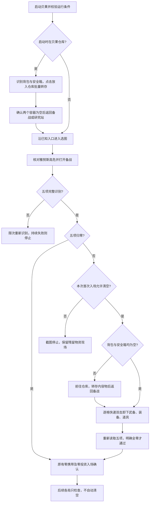

# 贝果启动时自动清空战备

每次启动贝果任务时，正式应用仅在首次入场前允许自动清空携带物。清空操作先读取背包和安全箱占用，再选择处理方式：

| 条件 | 动作 |
| --- | --- |
| 背包和安全箱均为空 | 在备战页快速双击已装备槽位，逐件卸下物品 |
| 背包或安全箱有物品 | 先在仓库批量转存内容物，再返回备战页卸下已装备物品 |

清空后，入场操作重新核对零携带。核验通过后才允许入场。双击时序和验证范围见[验收场景](#验收场景)。

现有流程见[贝果自动化](bagel.md)，游戏机制见[备战物资与仓储](../../../game/gameplay/贝果计划.md#备战物资与仓储)，归档画面见[启动清空相关画面](../../../game/screens/贝果计划.md#启动清空相关画面)。

## 当前自动化行为

五项携带读数包括武备、装备和道具的三个价值，以及背包和安全箱的两个占用数。下表说明当前自动化规则，不表示所有分支均已通过实机验收。待实测分支见[画面建模与验证前提](#画面建模与验证前提)，证据范围见[验收场景](#验收场景)。

| 情况 | 处理 |
| --- | --- |
| 每次重新启动任务，首次入场前有携带物 | 允许清空。每次启动独立判断，不沿用上次的清空资格或进度 |
| 启动时停在结算仓库 | 先转存遗留物资，再回入口核对地图、难度和备战。不计成功局数 |
| 上次清空中断，重新启动时仍在非结算仓库 | 先处理剩余物品，再点击左上返回。识别上一页后，重新执行选图核验 |
| 同次运行内自动重开或进入下一局 | 只检查零携带。发现残留时停止，不再次自动清空 |
| 暂停后继续 | 仍属于同次运行，不重新开放首次清空 |
| 五项均明确为零 | 直接进入原有入场确认流程 |
| 背包和安全箱均明确为空，但仍有已装备物品 | 跳过仓库，直接逐格卸下已装备物品 |
| 备战五项有任一识别不清 | 只重新截图识别。持续失败时停止，不按零或非零处理 |
| 仓满、转存失败或必要画面、按钮持续识别失败 | 停止并截图，记录具体容器或槽位。保留已完成的转存 |

清空范围包括代理人武备、队伍装备（含背包装备）、道具、背包内容和安全箱内容。清空不更换代理人阵容，不出售、拆分或丢弃物品，也不自动腾出仓位。已卸下的装备不会重新穿回。再次启动时，操作从当前画面的剩余物品继续。

首次入场默认启用清空，不新增设置开关。启动清空与 `auto_clean_warehouse` 的结算出售设置独立。启动清空不调用出售流程，后续正常局的结算仍使用原有配置。

## 流程

背包或安全箱非空时，操作按以下顺序批量转存：

1. 在备战页点击「前往仓库」。
2. 核对左侧背包、安全箱和仓库数量。
3. 单击左下「放入仓库」一次。
4. 核对两个容器均为空、容量不变，且仓库占用未下降。
5. 返回备战页，快速双击右侧已装备槽位，逐件卸下武备、装备和道具。

出现部分转存或结果持续不明时，操作截图并停止，不重复点击。背包物品通过批量按钮转存，无需逐格打开详情或滚动寻找。

背包和安全箱均为空时，操作跳过仓库，直接卸下已装备物品。

图中的任一转存或返回步骤失败时，当前运行终止。操作不跳到入场，也不返回流程起点重复执行。

### 备战起点

从备战启动时，入场操作也先返回选图，再核对地图和难度。原先选择不能直接沿用。

清空操作读取五项携带读数。格式合法且无 OCR 冲突时，读数才可判为全零或非零。空值、冲突和非法容量均属于未知。未读到非零数值不能作为零值依据。

连续两帧的完整读数和槽位状态稳定后，操作按以下规则处理：

| 条件 | 动作 |
| --- | --- |
| 背包和安全箱均为零占用 | 直接逐格卸下装备。不点击「前往仓库」，不切换背包视图 |
| 背包或安全箱非空 | 打开仓库并点击「放入仓库」。确认两个容器为空、仓库余量足够后，返回备战 |
| 读数缺失或非法 | 限次重新识别，不按空容器处理 |

卸装依次处理三位代理人的武备槽、三格队伍装备和四格道具。操作只点击明确占用的槽位。空槽跳过，未知槽重新识别。武备双击位置为武备图标，不包括代理人头像、替换代理人按钮或左侧仓储候选物品。

每格卸装完成后，操作重新读取结果。背包内容清空后，才允许卸下背包装备。最终核验使用卸下后的实际容量，不要求容量与初始值相同。

全部处理后，操作重新识别完整五项，并调用 `zero_loadout()`。只有五项全零时，才设置 `zero_checked` 并点击「前往空洞」。仍有非零值时，操作报告具体项，不无限循环清空。

### 结算仓库起点

结算仓库不显示完整的五项备战数值，因此分两阶段核验：

1. 在仓库完整核对可见的背包、安全箱和仓库数量，再执行转存。
2. 返回备战后，按五项完整识别规则核验携带状态。

仓库中未显示的武备、装备和道具数值不能推测补齐。仓库安全箱格子识别也不能替代备战最终占用读数。

只有本次首次入场允许清空时，入场操作才能处理结算仓库起点。操作先确认这是结算仓库主画面，且没有出售界面或未知弹窗，再点击左下「放入仓库」一次。两个容器明确为空后，操作调用 `BagelReturn` 返回入口，重新选图并核对高危，再进入备战清空剩余装备。

启动入口、启动仓库返回节点，以及批量转存的每一轮，都先检查出售状态。命中以下任一状态时，操作立即停止并保留现场，不点击转存、确认或返回：

- 出售底栏。
- 快速选择。
- 出售预览。
- 获得齿轮硬币弹窗。

即使两个容器为空，操作也不能在出售界面报告转存成功。出售模式中仍可能显示「放入仓库」文字，因此该文字不能单独作为主画面依据。

启动清空不调用 `BagelSettleWarehouse`，避免触发出售。该流程不增加成功局数、连续空箱次数或失败局计数。启动时安全箱已空，操作仍需识别背包。

结算仓库的遗留物资检查仅在首次入场允许这条转存路径。后续各局仍保留原有检查和停止规则。

结算画面有撤离奖励时，背包标题会下移。既有背包数量区域读取失败后，操作在整屏 OCR 中查找左侧唯一的「背包 + 数量/容量」标题行，只定位该标题下方的格子。上方撤离奖励不属于背包，不参与转存。奖励仍由原有返回研究站流程处理。

## 批量入仓、双击卸装与完成判据

备战右侧已装备的武备、队伍装备和道具，均通过快速双击卸下。每件物品按以下顺序操作：

1. 在主画面核对源槽和数值。
2. 等待 0.5 秒。
3. 在当前轮次向目标槽心发送第一次点击，按住 0.08 秒。
4. 松开后等待 0.11 秒。
5. 向同一槽心发送第二次点击，按住 0.08 秒。
6. 双击完成后等待 0.5 秒。
7. 重新读取源槽和价值，核对变化。

两次按下的实际间隔约为 0.20 秒，包含控制器调用开销。卸装操作不识别或点击详情中的「放入仓储枢纽」。仓库内容物使用「放入仓库」批量按钮。

| 暂停、停止或点击失败的阶段 | 处理 |
| --- | --- |
| 点击前等待期间暂停或停止 | 不发送输入。恢复后重新识别，即使等待期间已恢复，也不能沿用暂停前截图点击 |
| 两次点击之间暂停或停止 | 立即停止本次卸装，不补发第二次点击 |
| 双击完成后暂停并恢复 | 只核验结果 |
| 任一次点击返回失败 | 停止，不重试输入 |

首次双击等待超时后，只有连续两帧同时满足以下条件，才允许重新双击一次：

- 原槽仍有物品。
- 五项读数与操作前相同。
- 所有槽位占用与操作前相同。

每格最多两次双击。第二次仍未生效、停留在详情或读数异常时，操作停止，不改用详情菜单。

| 操作位置 | 输入前条件 | 完成条件 |
| --- | --- | --- |
| 仓库左侧背包和安全箱 | 主画面明确。携带数量、可见格子状态和仓库占用可读，仓库未满 | 两个容器全部清空，容量不变，仓库占用不下降。允许合并堆叠后占用不变 |
| 备战右侧已装备槽 | 备战画面明确，目标槽有物品，对应价值可读 | 目标槽明确变空，对应价值下降，其他价值不变，背包和安全箱仍为空 |

仓库批量转存按两个容器的总占用核验，不依赖物品是否在可见页或是否自动排列。出现稳定的部分转存结果时，操作记录已转出的格数并停止，保留剩余物资。备战装备槽不会自动排列，转存后源槽必须变空。堆叠物必须整格转出。

### 稳定帧核验

备战中，连续两帧的五项读数和全部槽位占用一致，才判为稳定。任一槽位未知、五项识别不全或已离开备战画面时，操作清除上一帧记录，重新收集连续两帧。

空槽灰色图案和有物图标均有明暗动画，因此不要求图标像素静止。卸装完成仍要求目标槽为空、对应价值下降、其他价值不变。

仓库中，以下状态在连续两帧之间保持一致时，操作才允许点击批量按钮或确认转存：

- 背包、安全箱和仓库的数量与容量一致。
- 背包可见格子的位置一致。
- 每格占用状态一致。

任一格未知、数量读取不全、可见占用超过背包总数、无法定位完整行或已离开仓库主画面时，操作清除稳定记录。滚动或物品重排导致位置、占用变化时，操作重新开始两帧核验。转存完成仍需满足数量变化条件。

背包数量读为零时，操作也必须定位并核验可见格子。可见格仍有物品、格子状态未知或无法定位完整行时，操作只重新识别。达到 5 帧上限后，操作停止。转存前和点击后的结果核验均使用该规则。

只有数量为零、可见格明确为空，且连续两帧稳定，操作才允许按空背包继续。返回备战后的五项零携带核验和入场核验仍需执行。

备战价值先识别右侧面板，再用既有标题条区域筛选结果，避免识别左侧库存。标题条和整屏备用读取规则见[价值读取规则](bagel.md#价值读取)。

每格转存通过两帧核验后，当前截图已包含剩余槽位的稳定读数。操作可直接选择下一格，或报告清空完成，无需额外等待两轮相同状态。下一件双击后，操作仍等待 0.5 秒，并重新收集两帧核验结果。

每次转存后，操作等待新画面稳定，再判断结果。控制器返回点击成功或短提示「已放入仓储枢纽」均不足以证明转存完成。短提示可能来自上一件物品。

双击后持续停留在详情，且源物品未移走时，操作按未确认转存处理，不再点击菜单或其他物品。

### 清空对象与仓位检查

备战卸装只双击已确认属于随身携带的装备格子。备战左侧可能显示仓储候选列表，仓库右侧显示库存。这些库存均不属于清空对象。

仓库可见页为空，但背包总占用非零时，操作仍点击批量按钮，无需滚动寻找物品。可见页为空不能作为整个背包为空的依据。

需要转存容器内容时，仓库显示满仓则停止。转存后，仓库余量不足以容纳所有尚待卸下的占用槽时，操作报告仓库空位不足。该检查按每个占用槽最多需要一个新仓位保守计算，不表示物品一定无法堆叠。

两个容器本来就空时，操作直接卸装，不专门进入仓库预查空位，也不推定仓库一定有空位。每格仍需核验。未生效时，只按既有规则重试一次。持续未确认时，操作截图并停止。

### 等待与失败预算

| 阶段 | 等待或重试上限 |
| --- | --- |
| 一次未知状态 | 最多读取 5 帧，每帧间隔 0.5 秒 |
| 双击后的结果核验 | 最多等待 5 秒或检查 10 次，先达到任一上限时结束等待 |
| 右侧槽位明确无变化 | 最多重试一次双击。其余未确认结果停止 |
| 批量入仓后的结果核验 | 最多等待 5 秒或检查 10 次，先达到任一上限时结束等待。暂停恢复后只继续核验结果 |
| 批量转存操作 | 180 秒超时 |
| 清空操作 | 180 秒超时 |

框架在轮次之间检查超时。委托子操作期间，由子操作计时。上述参数仍待现场验证。参数调整只改变等待预算，不放宽成功条件。

失败信息至少包含阶段、容器或槽位、失败原因、当前五项中可读的数值、可读的仓库占用、已完成转存数量和截图名。例如：`启动清空失败：道具第 3 格入仓操作后仍有物品，已转存 8 格；现场截图：…`。只报告“请手动清空”无法说明失败步骤。

## 模块与状态落点

| 位置 | 职责 |
| --- | --- |
| `BagelApp` | 管理本次运行的首次清空资格。将结算仓库起点交给入场操作，后续各局保留遗留物资检查 |
| `BagelEnter(ctx, *, allow_clear_loadout: bool = False)` | 核验选图、难度、入场和投资。首次结算仓库转存后返回入口。备战非零且允许清空时，调用清空操作 |
| `BagelClearLoadout(ctx)` | 从备战开始处理内容物和已装备槽。成功时仍在备战，且五项归零。失败时保留现场 |
| `BagelStoreCarried(ctx)` | 从明确的贝果仓库主画面开始，点击「放入仓库」批量转存背包和安全箱。成功时两个容器为空，且仍在仓库。不负责返回、卸装或出售 |
| `bagel_screen.py` / `BagelTransferOperation` | 区分完整值和未知状态。转存基类共用快速双击、暂停处理、稳定帧检查和失败进度记录 |

备战清空和结算仓库启动共用 `BagelStoreCarried`。`BagelDeposit` 依赖结算仓库，只处理安全箱，并使用批量按钮。备战仓库不直接调用它，其现有结算行为和测试保留。

`BagelApp.handle_init()` 初始化 `initial_clear_pending=True`。第一次调用 `BagelEnter` 前，应用将该值保存到局部参数，并立即置为 `False`。后续入场调用均传 `False`。

`attempts == 0` 不能代替首次清空资格。`attempts` 在出生点识别时才增加，不能说明首次入场资格是否已使用。

第一次入场内的结算仓库转存和备战卸装共用同一次资格。失败直接向上返回，不恢复资格。只有用户停止后重新启动应用，资格才重新初始化。暂停、恢复和节点重试不得调用应用初始化重新取得资格。独立开发工具继续使用默认 `False`，不自动扩大卸装范围。

清空是独立子操作，不占用 15 秒的「核对零携带」节点预算。允许清空的首次入场总超时为 660 秒，包括启动仓库转存、返回入口、导航、备战清空和加载。默认只核验的入场总超时仍为 240 秒。

## 画面建模与验证前提

数值和画面按钮复用既有 screen_info 区域。「前往仓库」通过整屏 OCR 精确匹配。备战缺少该文字时，操作点击已核对的背包数量区域，切回背包视图。

右侧卸装不需要识别详情按钮。装备槽沿用贝果格子识别方式，使用原生 1080p 槽心和图像判断。背包行根据图像边框重新定位。这些槽位尚无独立的 screen_info 区域或模板。

归档画面用于真实 OCR 和图像识别回归。流程测试用模拟控制器记录仓库批量按钮输入，以及备战同一槽位的两次快速点击，并切换画面。验证范围见[验收场景](#验收场景)。后续区域和模板建档按[画面建档技能](../../../../skills/zzz-od-dev-screen-onboarding/SKILL.md)执行。

以下内容尚待实机验证：

- 批量入仓同时清空非空背包和安全箱。
- 不同类型堆叠物是否整格转出。
- 仓满和部分转存时的停止行为。
- 后台双击响应时序。

## 验收场景

### 双击时序依据与验证范围

双击时序同时约束点击前等待、按住时长和松开间隔，避免输入过快时只开关详情、未完成转存。发送两次点击后，操作仍需重新读取源槽和价值，确认转存结果。

游戏内部的事件采样和冷却机制尚未明确。单个时序参数不能直接认定为未转存的根因。

已归档的代表帧用于画面识别和离线回归，不能证明连续流程的实机执行效果，见[启动清空相关画面](../../../game/screens/贝果计划.md#启动清空相关画面)。

实机验收需要原生 1080p 画面，以及具备相应输入权限的控制器。验收时，运行完整的 `BagelClearLoadout.execute()`，并核对以下结果：

- 各格点击位置正确。
- 转存后源槽变空。
- 对应价值下降。
- 背包和安全箱均为空。
- 最终五项携带读数均为零。

离线回归覆盖点击前等待期间暂停、双击中断、一次重试上限和结果核验，但不能替代游戏接收输入的真实时序验证。后台模式仍待专门验证。

### 空容器分支验证范围

备战中连续两帧确认背包和安全箱均为空时，操作从「核对启动携带」直接进入「逐格卸下战备」，跳过仓库往返和仓位预查。有内容物时，操作仍执行入仓、余量检查和返回流程。

完整流程测试覆盖 `0/50`、`0/20` 两种空背包，以及背包为空但安全箱有物品的分支。空容器测试检查全部输入仅落在已装备槽位。

该分支已有离线流程回归覆盖，尚未完成实机验证。

### 自动化回归

测试位于独立仓 `zzz-od-test/test/zzz_od/application/bagel/`，按被测模块分别放入 `bagel_app/`、`bagel_enter/`、`bagel_clear_loadout/`、`bagel_store_carried/`、`bagel_transfer/` 和 `bagel_screen/`。每个文件主要检查一个被测方法。

共用控制器、合成画面和运行状态清理位于 `zzz-od-test/test/harness/bagel_loadout.py`。识别和流程测试使用真实 OCR、归档画面和合成中间帧。价值读取边界用例按区域提供 OCR 数据，不依赖调用顺序。

模拟控制器收到仓库批量按钮点击后，切换到清空结果。备战中，第一次点击后显示详情截图，同一槽位第二次点击后切换到卸装结果。测试同时检查既有入场、结算和连续运行行为。下表列出行为验收条件，现场输入效果仍需按[双击时序依据与验证范围](#双击时序依据与验证范围)补测。

启动仓库的完整入场流程测试位于同级 `bagel_enter/test_starting_warehouse_flow.py`。测试通过 `BagelEnter.execute()` 检查批量转存、返回备战、重新选图、零携带和零投资核验，并检查节点切换时点击标记重置。测试还覆盖返回无效、节点超时、点击失败和出售界面启动时停止。

批量转存的出售状态回归位于 `bagel_store_carried/test_store_next.py`。测试使用已有实拍图，确认转存前和等待结果期间遇到出售状态时均停止，不发送输入。

零读数回归以归档仓库截图为底，合成数量为零、格子遮挡或边框缺失的异常帧。其余画面保持原样，并使用真实 OCR 和格子识别。

节点测试检查真实空背包连续两帧才完成，以及异常帧打断稳定记录后重新核验。完整转存流程测试覆盖点击前和点击后持续冲突、未知或定位失败。测试确认读取 5 帧后停止，不误报成功，也不补点批量按钮。

| 场景 | 必须观察到的结果 |
| --- | --- |
| 首次备战五项全零，左侧仓储候选列表有很多物品 | 无搬运输入，进入原有确认流程 |
| 背包 0/50 或 0/20 且安全箱为空，仍有装备 | 不点击「前往仓库」。仅双击已装备槽，并核对归零 |
| 背包为空但安全箱有物品 | 先进入仓库批量转存安全箱，再卸下装备 |
| 三项价值非零，背包有物品，安全箱为空 | 先批量入仓内容物，再逐格快速双击卸装 |
| 安全箱非空，背包物品不在可见页 | 只点击一次批量按钮，不滚动。两个容器总占用归零后才完成 |
| 卸下背包后容量由 50 变为 20 | 接受最终 `0/20`，不要求 `0/50` |
| 空槽或有物图标持续闪动，五项读数和槽位占用不变 | 连续两帧状态一致即可继续。转存仍要求源槽为空，且价值变化正确 |
| 仓库格子图标持续闪动，数量、位置和占用未变 | 能点击批量按钮并核验转存。未知帧、滚动或占用变化必须打断连续稳定记录 |
| 左侧库存有大量同类物品 | 常规价值 OCR 不处理左侧库存，五项读数仍正确。卸装不使用详情 OCR |
| 一件转存通过两帧核验，仍有剩余槽位 | 同轮选择下一件，不重复采集两帧相同备战状态。最后一件直接报告完成 |
| 单项读不出，或 OCR 的 0 与非零证据冲突 | 等待期间无搬运输入。持续失败时停止，不入场 |
| 双击后所有读数和槽位均未变化 | 等待预算耗尽后重试一次双击。再次未生效时停止 |
| 双击后停留在详情、只转出部分堆叠或去向异常 | 限时等待后停止，不重试 |
| 双击后一度仍是旧帧，随后源物品消失 | 等待新帧，确认后才处理下一件。不补发动作 |
| 仓库占用不变，且源物品完全转出 | 未满仓时允许堆叠。满仓时不尝试转存 |
| 已转存几件后仓满或失败 | 停在现场，日志说明进度，不回滚。下一次启动只处理剩余物品 |
| 首次从有遗留物资的结算仓库启动 | 先转存，再返回、选图和复核五项。无出售输入，不计成功局数 |
| 首次启动或转存核验时出现出售底栏、快速选择、出售预览或获得硬币弹窗 | 停止并保留现场。不转存、不确认、不返回，也不报告空箱成功 |
| 非结算仓库返回无效、超时或控制器报告点击失败 | 停在返回节点，不继续选图或入场。点击成功但画面未变化时，不重复返回 |
| 同次运行第二局有残留，或首次进入后出生识别尚未增加 attempts | 不再取得清空资格。有残留时停止 |
| 两次点击之间暂停 | 停止，不续发第二次点击，不重置首次清空资格 |
| 点击前等待期间暂停又恢复 | 不发送点击。重新识别后，再选择物品 |
| 清空后五项仍非零、零投资未确认或弹窗未知 | 不允许入场，继续使用已有严格核验规则 |

现场验收先检查各类物品的实际双击转存响应，再检查失败截图、未生效最多重试一次、仓满停止和第二局拒绝残留。模拟控制器验证不能代替实机验证。
