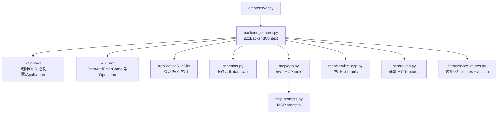

# 后端服务层架构

> `ZzzBackendContext` 是 `ZContext` 之上的传输无关 backend。它不关心调用方来自 MCP、HTTP 还是 GUI 管理页，只提供稳定的业务方法和运行状态。

## 概览



## 模块布局

```text
src/zzz_od/backend/
  schemas.py             # WindowStatus / AnalyzeScreenResult / RunStatusResult / ApplicationListResult
  backend_context.py     # ZzzBackendContext + RunSlot + ApplicationRunSlot
  mcp/
    app.py               # create_mcp_server + 基础 game tools
    service_app.py       # list_applications / run_one_dragon / run_standalone_app
    prompts.py           # MCP prompt 案例与注册
  http/
    routes.py            # register_http_routes + 基础 /game/* handler
    service_routes.py    # /health + 应用运行 HTTP handler
  entry/
    server.py            # create_app / uvicorn 入口
```

## ZzzBackendContext

`ZzzBackendContext` 持有一个 `ZContext`，由服务入口注入。所有对外方法在进入业务逻辑前先检查 `ctx.ready_for_application`。

| 方法 | 作用 | 返回 |
|---|---|---|
| `check_window()` | 查询游戏窗口状态 | `WindowStatus` |
| `capture()` | 截取当前游戏画面 | RGB `MatLike` |
| `analyze()` | 截图 + OCR + 画面匹配 | `AnalyzeScreenResult` |
| `start_run(source, op_factory)` | 启动基础 operation | `(ok, future)` |
| `run_one_dragon(source)` | 按当前配置启动完整一条龙 | `(ok, future)` |
| `run_standalone_app(source, app_id=None)` | 启动独立应用 | `(ok, future)` |
| `list_applications()` | 列出当前实例可运行应用和独立应用选择状态 | `ApplicationListResult` |
| `query_status()` | 查询当前或最近一次运行状态 | `RunStatusResult` |
| `stop()` | 发出停止信号 | `dict` |
| `close_game()` | 发关闭窗口信号，不走运行槽 | `str` |

## 运行槽

`RunSlot` 是 operation 运行槽，服务 `open_game` 这类 `Operation`。它负责：

- 单跑道并发拒绝。
- 后台线程执行 `op_factory(ctx).execute()`。
- 固化终态、最近状态、失败节点、耗时。
- 通过 `run_context.stop_running()` 发停止信号。

`ApplicationRunSlot` 继承 `RunSlot`，只保留应用运行差异：

- 委托 `run_context.run_application(app_id, instance_idx, group_id)`，复用 GUI 应用运行路径。
- 从 `run_context.last_application_result` 固化终态、最近状态和失败节点。
- 运行一条龙和独立应用，不塞进 operation 槽。

运行一条龙、独立应用和列应用前，`ZzzBackendContext` 会刷新当前进程内的实例配置，并清理 `ApplicationFactory` / 应用组缓存。这样 GUI 已写入 YAML 的设置更容易被外置 server 进程读取；仍不处理 GUI 主进程和 server 子进程同时操作游戏的跨进程互斥。

`ZzzBackendContext.query_status()` 和 `ZzzBackendContext.stop()` 会同时检查两个槽。当前正在运行的槽优先；都不在运行时返回最近一次运行历史。

## 适配器

MCP 与 HTTP 只做传输适配：

- MCP 基础工具在 `mcp/app.py`，应用运行工具在 `mcp/service_app.py`，prompt 在 `mcp/prompts.py`。
- HTTP 基础端点在 `http/routes.py`，应用运行和 `/health` 在 `http/service_routes.py`。
- 两边都只调用 `ZzzBackendContext` 公开方法，不直接操作运行槽私有状态。

## 进程模型

- `entry/server.py` 是 headless server 入口，会创建独立 `ZContext`。
- GUI 主程序仍是另一个入口；「开发工具 -> MCP 服务」页面启动的是本机 server 子进程。
- 当前只保证同一 backend 进程内的运行互斥；GUI 主进程与外置 server 子进程之间不做跨进程互斥。

## 路线图（尚未实现）

- 事件推送：WebSocket / SSE 或 MCP notifications。
- 多实例：`list_instances` / `switch_instance`。
- 更多 game 感知与交互 tool。
- 更完整的 AI 操作范式。

## 相关文档

- [README.md](README.md) - 总览
- [mcp.md](mcp.md) - MCP 适配器
- [http.md](http.md) - HTTP 适配器
- [entry.md](entry.md) - 服务入口
