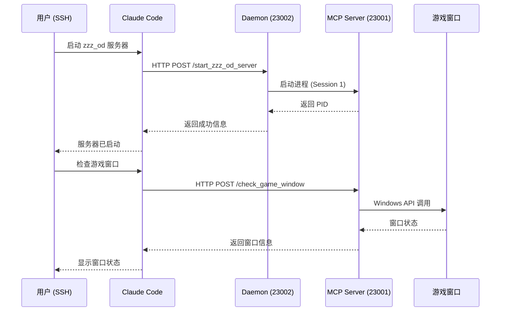
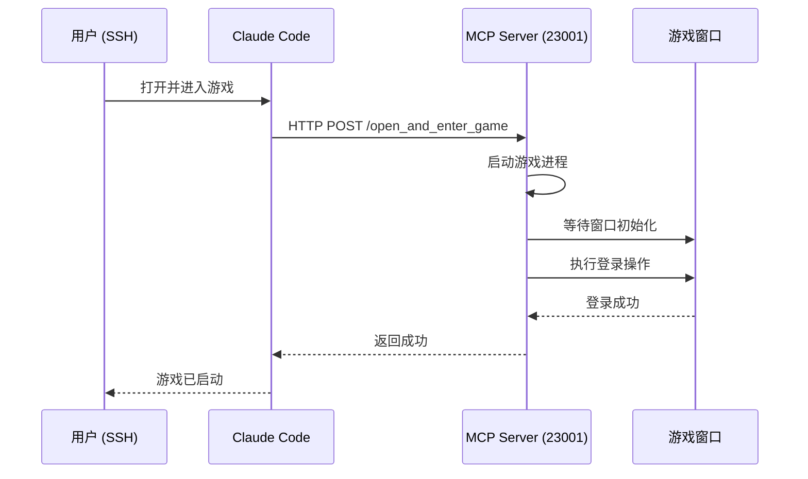

# 架构设计

本文档介绍 ZZZ OD MCP Server 的系统架构和设计原理。

## 整体架构

```
┌─────────────────────────────────────────────────────────────────┐
│                         SSH 远程环境                              │
│                      (Session 0 - 服务会话)                       │
├─────────────────────────────────────────────────────────────────┤
│                                                                 │
│  ┌─────────────┐                                                │
│  │ Claude Code │                                                │
│  └──────┬──────┘                                                │
│         │                                                       │
│         │ HTTP (MCP)                                            │
│         ▼                                                       │
│  ┌─────────────────────────────────────────────────────────┐   │
│  │               Claude Code MCP Configuration              │   │
│  ├─────────────────────────────────────────────────────────┤   │
│  │  zzz_od_daemon: stdio -> HTTP://127.0.0.1:23002/mcp     │   │
│  │  zzz_od:        HTTP -> HTTP://127.0.0.1:23001/mcp      │   │
│  └─────────────────────────────────────────────────────────┘   │
└─────────────────────────────────────────────────────────────────┘
                            ▲
                            │ HTTP
                            │
┌─────────────────────────────────────────────────────────────────┐
│                      游戏本机 (Session 1)                         │
│                    (交互式桌面会话 - 管理员权限)                   │
├─────────────────────────────────────────────────────────────────┤
│                                                                 │
│  ┌─────────────────────────────────────────────────────────┐   │
│  │           ZZZ OD Daemon (管理服务器)                      │   │
│  │           端口: 23002 (HTTP)                              │   │
│  │           传输: streamable-http                          │   │
│  ├─────────────────────────────────────────────────────────┤   │
│  │  工具:                                                    │   │
│  │  - start_zzz_od_server                                   │   │
│  │  - stop_zzz_od_server                                    │   │
│  │  - restart_zzz_od_server                                 │   │
│  │  - get_zzz_od_server_status                              │   │
│  └──────────────────────┬──────────────────────────────────┘   │
│                         │ 启停控制                               │
│                         ▼                                       │
│  ┌─────────────────────────────────────────────────────────┐   │
│  │         ZZZ OD MCP Server (游戏操作服务器)                 │   │
│  │         端口: 23001 (HTTP)                                │   │
│  │         传输: streamable-http                            │   │
│  ├─────────────────────────────────────────────────────────┤   │
│  │  工具:                                                    │   │
│  │  - check_game_window      检查游戏窗口状态                 │   │
│  │  - capture_game_screen    捕获游戏画面                    │   │
│  │  - open_and_enter_game    打开并进入游戏                  │   │
│  │  - ... (更多游戏操作工具)                                │   │
│  └──────────────────────┬──────────────────────────────────┘   │
│                         │                                       │
│                         │ Windows API                          │
│                         ▼                                       │
│  ┌─────────────────────────────────────────────────────────┐   │
│  │              绝区零游戏窗口                               │   │
│  │              (Session 1 - 交互式桌面)                      │   │
│  └─────────────────────────────────────────────────────────┘   │
│                                                                 │
└─────────────────────────────────────────────────────────────────┘
```

## 核心组件

### 1. Daemon (管理服务器)

**文件**: `tools/mcp/daemon/zzz_od_daemon.py`

**职责**:
- 长期运行在 Session 1（交互式桌面会话）
- 管理游戏操作服务器的启停
- 提供远程管理接口
- 资源占用极小

**特性**:
- 端口: 23002
- 传输方式: HTTP (streamable-http)
- 运行时长: 长期运行（开机自启）
- 工具数量: 5 个（管理工具）

### 2. MCP Server (游戏操作服务器)

**文件**: `src/zzz_mcp/zzz_mcp_server.py`

**职责**:
- 执行游戏窗口操作
- 提供游戏画面感知
- 触发鼠标点击等操作

**特性**:
- 端口: 23001
- 传输方式: HTTP (streamable-http)
- 运行时长: 按需启动
- 工具数量: 多个（游戏操作工具）

### 3. Claude Code 配置

**位置**: `~/.claude.json`

**配置示例**:
```json
{
  "mcpServers": {
    "zzz_od_daemon": {
      "transport": "stdio",
      "command": "uv run --directory D:/code/workspace/ZenlessZoneZero-OneDragon python tools/mcp/daemon/zzz_od_daemon.py"
    },
    "zzz_od": {
      "transport": "http",
      "url": "http://127.0.0.1:23001/mcp",
      "timeout": 30000
    }
  }
}
```

## 设计原理

### Session 隔离问题

Windows 的会话隔离机制导致不同会话之间无法直接交互：

| 会话 | 名称 | 说明 |
|-----|------|------|
| Session 0 | 服务会话 | SSH、系统服务运行在此会话 |
| Session 1 | 交互式桌面会话 | 用户桌面、游戏窗口运行在此会话 |

**关键问题**:
- SSH 运行在 Session 0
- 游戏窗口运行在 Session 1
- Session 0 无法直接操作 Session 1 的窗口

### PsExec 的限制

尝试使用 PsExec 跨会话启动时遇到的问题：

```
PsExec -i 1 cmd /c "start_mcp_server.ps1"
```

**限制**:
1. 无法提权到管理员权限
2. `pyautogui`、`pydirectinput` 等库需要管理员权限
3. 跨会话启动导致权限上下文丢失

**结论**: PsExec 方案不可行

### 解决方案：Daemon 架构

**核心思想**: 在 Session 1 中长期运行一个轻量级管理服务器

**优势**:
1. ✅ Daemon 在 Session 1 启动，拥有管理员权限
2. ✅ Daemon 启动的 MCP Server 继承管理员权限
3. ✅ 可通过 HTTP 远程控制
4. ✅ 资源占用小，可长期运行
5. ✅ 支持开机自启

## 数据流

### 启动流程



### 操作流程



## 端口分配

| 端口 | 服务 | 用途 | 长期运行 |
|-----|------|------|---------|
| 23001 | MCP Server | 游戏操作 | ❌ 按需 |
| 23002 | Daemon | 管理服务 | ✅ 是 |

## 安全考虑

1. **本地监听**: 所有服务默认监听 127.0.0.1，不暴露到外网
2. **权限继承**: Daemon 和 MCP Server 都需要管理员权限
3. **环境变量**: 使用 `.env` 文件管理敏感配置

## 性能优化

1. **按需启动**: MCP Server 只在需要时启动，节省资源
2. **轻量级 Daemon**: Daemon 资源占用极小，可长期运行
3. **HTTP 传输**: 使用 streamable-http，性能优于 stdio

## 扩展性

架构支持轻松添加新的游戏操作工具：

1. 在 `src/zzz_mcp/tools/` 下添加新工具
2. 在 `zzz_mcp_server.py` 中注册工具
3. 重启 MCP Server 即可使用
